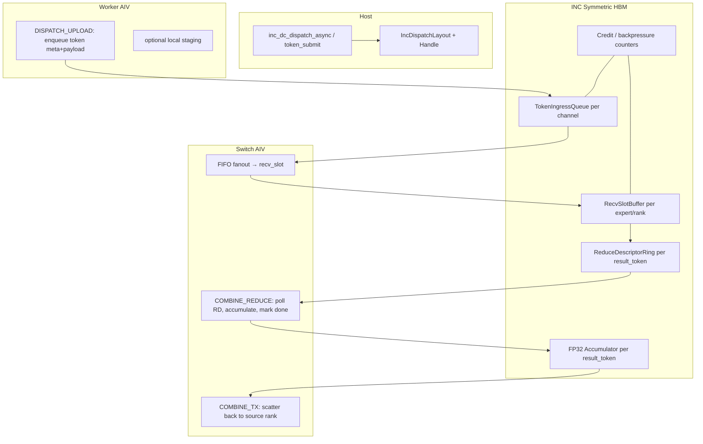

# DC-AB：显存缓冲 + 全异步 Token + 多 AIV Reduce 轮询

## 1. 目标

在保持 DC00 ABI（vLLM / Megatron 可对接）前提下，新增引擎 **`dc_ab`（async buffer）**：

1. **到达时间差由 INC HBM 吸收**：token 进入持久 buffer，producer 不等待 consumer 释放后才可继续入队。
2. **逐 token 全异步**：upload、switch fanout、destination 入槽、reduce 就绪各自独立推进。
3. **多 AIV 轮询 reduce**：多个 switch/worker block 按 `IncDcResultTokenDesc` 分区 poll「该 token 所需 contribution 是否到齐」，到齐即 reduce。

与当前 **`dc_ll`** 的差异：

| 维度 | dc_ll（基线） | dc_ab（目标） |
|------|---------------|---------------|
| 计划时机 | epoch 前静态 mask/descriptor | token 到达后动态入队 + 可选预分配 slot |
| Host 同步 | 每 epoch `aclrtSynchronizeStream` | `IncDcEvent` + 可选 persistent kernel |
| 缓冲 | ring_depth=8，credit 与槽位绑定 | 深 HBM queue（按 token 槽位池） |
| Reduce | 仅在 combine 阶段 | dispatch 侧可预聚合 / combine 复用同一 poll 模型 |

---

## 2. 架构总览



### 2.1 显存缓冲模型

**TokenIngressQueue**（每 worker×channel 或每 expert 一条 SPSC）：

```cpp
struct DcAbTokenSlot {
    IncDcTokenId token_id;
    uint32_t payload_offset;      // local_hidden 或 scratch 内偏移
    uint32_t dest_rank_mask;
    uint32_t expert_ids[kMaxTopk];
    float    weights[kMaxTopk];
    uint32_t arrival_seq;         // 单调序号，用于乱序到达
    uint32_t state;               // FREE → PUBLISHED → FANOUT_DONE → REDUCED
};
```

- Producer（worker upload block）只做 **PUBLISH**：写 payload + meta，doorbell 递增，**不**等 egress reclaim。
- Consumer（switch fanout block）从 queue 取 slot，fanout 到各 rank 的 `RecvSlotBuffer`。
- Slot 回收延迟到 **reduce 完成 + combine_inverse 确认**，而非 dc_ll 的 immediate reclaim。

**RecvSlotBuffer**：沿用 `recv_slot` 布局，但改为 **环形槽位池**（深度 `DC_AB_RECV_DEPTH`，建议 64–512，独立于 `kDcLlMaxRingDepth=8`）。

**ReduceDescriptorRing**：每个待归并的 `(source_rank, source_token)` 一条记录：

```cpp
struct DcAbReduceDesc {
    IncDcTokenId token_id;
    uint32_t expected_contrib;    // 来自 handle.expected_contrib_per_token
    uint32_t arrived_contrib;   // device 原子累加
    uint32_t contrib_bitmap;      // 小 topk 可用 bitmap
    uint32_t accum_slot;          // FP32 accumulator 索引
    uint32_t state;               // WAITING → READY → REDUCED
};
```

### 2.2 多 AIV 轮询 reduce

复用 `IncDcAivProfile` 分区思路（参考 `inc_dc_aiv_profile.h`）：

| Switch 角色 | 职责 |
|-------------|------|
| `DISPATCH_DATA` | ll_fifo fanout（可复用 dc_ll switch_fifo 骨架） |
| `COMBINE_REDUCE` | `for (tid = bid; tid < num_result_tokens; tid += bnum)` poll `DcAbReduceDesc[tid]` |
| `COMBINE_TX` | reduce 完成后 putmem 回 source rank |

每个 reduce block 循环：

1. 读 `DcAbReduceDesc[tid].arrived_contrib` vs `expected_contrib`
2. 未到齐 → `continue`（hint-plane / 指数退避 spin，避免 HOL）
3. 到齐 → 从各 `RecvSlotBuffer` 拉 hidden，**FP32 accumulate**（与 `inc_dc_combine_reduce_result_kernel` 一致）
4. 写回 `combined_hidden` 或 expert output staging；`state = REDUCED`；doorbell 通知 host/event

Worker 侧可增加 **CONSUME_POLL** block（`worker_dispatch_count >= 2` 时），专职 poll 本 rank 收到的 token，减轻 switch 压力。

### 2.3 与 dc_ll 的代码复用

| 复用 | 新建/大改 |
|------|-----------|
| SHMEM putmem/quiet、对称堆分配 | `DcAbTokenSlot` 队列与深 buffer |
| `DcLlChannelTailLine/HeadLine` FIFO 语义 | 解耦 credit 与 epoch |
| `IncDcCombineReducePlan` 分 token 逻辑 | 动态 `ReduceDescriptorRing` |
| `IncDcAivProfile` 分区 | persistent kernel + event 驱动 |
| NCCL 式 profile tuner（queue depth 等） | `dc_ab` 专用 profile 表 |

---

## 3. Host API 草案（C++）

见 `examples/inc/dispatch_combine/async_buffer/inc_dispatch_dc_ab.h`。

要点：

- **`inc_dc_token_submit_async`**：单 token 或 sub-batch 入队（不要求整 batch 到齐）。
- **`inc_dc_dispatch_async`**：DC00 兼容入口；内部创建 session + 启动 persistent worker/switch kernel。
- **`inc_dc_event_query`**：按 `op_seq` 或 per-token completion bitmap 查询。
- **Handle** 仍携带 `combine_inverse`，供 combine / backward 使用。

---

## 4. vLLM 对接：输入输出格式

### 4.1 `IncAll2AllManager.dispatch`

| vLLM 参数 | INC 映射 | dc_ab 注意点 |
|-----------|----------|--------------|
| `hidden_states` `[T, H]` | `IncDcTensorDesc`: `data`, `num_tokens=T`, `hidden_size=H`, `stride_token_bytes` | decode 时 **T 可逐 token submit**；不必一次凑满 batch |
| `topk_ids` `[T, K]` | `IncDcRouteSpec.topk_expert_ids` | 支持 `-1` padding；route 可随 token 到达再填 |
| `topk_weights` `[T, K]` optional | `IncDcRouteSpec.topk_weights` | combine 需保留；dispatch 可只传 ids |
| `extra_tensors` list | `IncDcTensorDesc* extra_tensors, num_extra_tensors` | 每个 extra 与 hidden **同 T 维**；slot 内 meta 记录 offset |
| 返回值 `recv_hidden` | `IncDispatchResult.recv_hidden` | layout: `[num_recv_assignments, H]` 或 expert-major；**需在 layout 中声明** |
| 返回值 `recv_topk_ids/weights` | `IncDispatchResult.recv_topk_*` | 与 recv 行对齐 |
| `counts` per expert | `IncDispatchLayout.num_tokens_per_expert[]` | 异步模式下可 **增量更新** 或最后一次性读 |
| `async` stream | `IncDcEvent previous_event`, `async_finish` | **必须** 实现真实 event，不能 stub |

### 4.2 `IncAll2AllManager.combine`

| vLLM 参数 | INC 映射 | dc_ab 注意点 |
|-----------|----------|--------------|
| `hidden_states` expert 输出 | `IncDcTensorDesc expert_output` | shape: `[total_expert_tokens, H]` 或 `[E, cap, H]` — **layout 合同必须固定** |
| 隐式 handle | `IncDispatchHandle*` | 含 `combine_inverse` + `expected_contrib_per_token` |
| `topk_weights` | combine 时按 inverse 加权 | reduce 在 FP32；输出 cast 回 BF16/FP16 |
| 返回 combined | `IncCombineResult.combined_hidden` `[T_local, H]` | 与 dispatch 前 **source token 顺序** 一致 |

### 4.3 vLLM decode 特有

- **T=1 或极小 batch**：buffer 深度小但到达间隔大；`dc_ab` 应用 `topk2_small` 类稳定性参数 + **ingress queue 深度 ≥ 16**。
- **Continuous batching**：`IncDcTokenId.task_id` 必须携带 **request id / seq slot**，避免不同 request token 混 reduce。
- **CUDA graph / ACL graph**：persistent kernel 更友好；需固定 scratch 地址，submit 只写 slot index。

---

## 5. Megatron 对接：六阶段与 I/O

| Megatron 阶段 | INC API | 输入 | 输出 |
|---------------|---------|------|------|
| `dispatch_preprocess` | host | `hidden [S,B,H]` 或 `[T,H]`, `routing_map` | 规范化 `IncDcRouteSpec`, 可选 `get_dispatch_layout` |
| `token_dispatch` | `inc_dc_dispatch_async` | `IncDcTensorDesc x`, `route`, `layout` | `IncDispatchResult`, `IncDispatchHandle*` |
| `dispatch_postprocess` | host | result tensors | Megatron 期望的 `(tokens, routing_map)` 格式 |
| `combine_preprocess` | host | expert MLP 输出 | `IncDcTensorDesc expert_output` |
| `token_combine` | `inc_dc_combine_async` | handle + expert_output | `IncCombineResult` |
| `combine_postprocess` | host | combined | 还原 `[S,B,H]` |
| **backward** | handle 保留 | `combine_inverse` | 梯度 scatter 到 expert 与 source |

### 5.1 Megatron 特有字段

| 字段 | 说明 | dc_ab 要求 |
|------|------|------------|
| `route_epoch` | 权重更新后递增 | stale handle → `ERR_HANDLE_STALE` |
| `expert_to_rank` | 静态或 slow-changing | 与 `IncDcGroupConfig` 一致 |
| `num_tokens_per_rank[]` | 全局 token 计数 | layout 可 async 累加 |
| **TP/PP/EP 维** | Megatron 只暴露 EP 侧 dispatch | INC 侧 `group_size` = EP world；hidden 已是 TP 切分后 |
| **Variable seq length** | microbatch 内 pad | `topk_expert_ids=-1` + `num_tokens` 有效长度 |

### 5.2 Autograd

- Forward handle 必须保留 **`combine_inverse`**（已有 `IncCombineInverseEntry`）。
- Backward：`token_combine` 的梯度路径与 forward inverse 对称；dc_ab 的 **reduce 顺序** 必须确定性（同一 `(source_rank, source_token)` 始终同一 accum slot）。
- Python gate：`i03_megatron_adapter_autograd_gate.json` — 需从 host stub 升级到真实 binding 后重跑。

---

## 6. Layout / Handle 合同（两框架共用）

### IncDcTensorDesc（输入）

```cpp
void*    data;
uint64_t num_tokens;          // 逻辑 token 数（可 < 分配容量）
uint32_t hidden_size;
IncDcDType dtype;             // BF16/FP16/FP32
uint64_t stride_token_bytes;  // >= hidden_size * elem_size，允许 padding
```

### IncDispatchLayout（layout 阶段输出）

- `num_tokens_per_rank[group_size]`
- `num_tokens_per_expert[num_experts]`
- `recv_*` 容量上界（dc_ab 用 `DC_AB_RECV_DEPTH` 校验 `ERR_CAPACITY_EXCEEDED`）

### IncDispatchResult（dispatch 输出）

- `recv_hidden`：destination rank 上收到的 assignment 行主序 hidden
- `recv_topk_expert_ids`, `recv_topk_weights`：与 recv 行对齐
- `num_recv_tokens_per_expert`：可选统计

### IncDispatchHandle（跨 dispatch/combine）

- `assignments[]`：`IncDcAssignmentMeta`（含 `IncDcTokenId`）
- `combine_inverse[]`：combine 反查表
- `expected_contrib_per_token[]`：reduce poll 的 **expected_contrib** 来源

---

## 7. 实现阶段建议

| 阶段 | 内容 | Gate |
|------|------|------|
| S0 | 冻结 dc_ll manifest；新建 `async_buffer/` 目录 | 文档 |
| S1 | HBM `TokenIngressQueue` + 单 token submit host API | 单 rank 功能 |
| S2 | Switch fanout + RecvSlotBuffer 解耦 credit | 9-rank functional |
| S3 | `ReduceDescriptorRing` + 多 AIV poll reduce | 与 combine golden 对比 |
| S4 | `inc_dc_dispatch_async` 接 DC00；event 真实化 | dc00_gate |
| S5 | Python binding 替换 numpy stub | i02/i03 gate |
| S6 | NCCL 式 profile tuner 扩展 `dc_ab` queue depth | traversal gate 子集 |

---

## 8. 风险与约束

1. **HBM 容量**：`DC_AB_RECV_DEPTH × max_tokens × hidden × 2` 需可配置上限，防止 OOM。
2. **乱序到达**：`IncDcTokenId` + `arrival_seq` 必须全链路携带；reduce 只认 contrib 计数，不认到达顺序。
3. **Deadlock**：producer 无限入队而 consumer stall → host 可见 `queue_full_count` + backpressure（返回 `ERR_CAPACITY_EXCEEDED` 或阻塞 event）。
4. **确定性**：同一 shape 应用 NCCL 式 profile 选 queue depth / poll mode，禁止 runtime retry 换配置。
