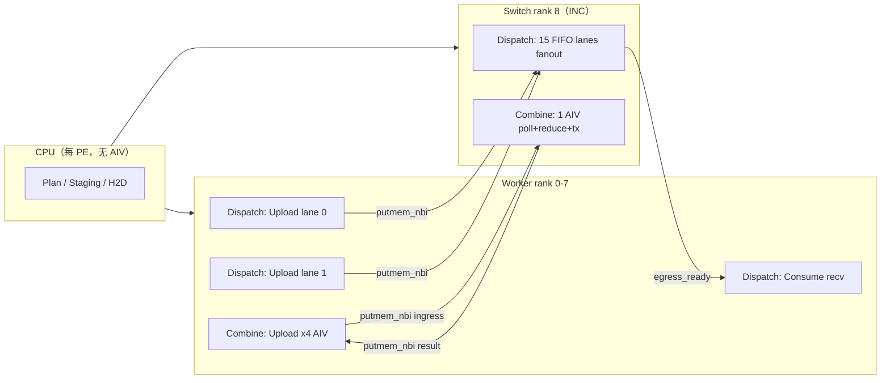

# INC Dispatch / Combine 实现说明

> 代码根目录：`shmem/examples/inc/dispatch_combine/`  
> 拓扑：8 个 **Worker PE**（rank 0–7）+ 1 个 **Switch INC PE**（rank 8，即 `group_size`）  
> 本文「Host 侧」指 Worker rank 上的 AIV 行为；「INC 侧」指 Switch rank 上的 AIV 行为。CPU 上的规划/Staging 在初始化章节单独说明。

---

## 第一部分：架构与行为总览

### 1. 如何进行初始化

#### 1.1 公共基础设施（CPU，每个 PE）

所有 dispatch / combine 用例在每个 PE 上首先完成 SHMEM 与 ACL 初始化：

1. `aclInit` → `aclrtSetDevice(pe)` → `aclrtCreateStream`
2. `aclshmemx_init_attr` 建立对称堆
3. `aclshmem_malloc(heap_need)` 分配对称内存（combine 默认 ≥ 512 MiB）
4. 全 PE `aclshmem_barrier_all()` 同步

入口文件：
- Dispatch：`inc_dc_dispatch_main.cpp` → `RunCaseDcLl()`（`INC_DC_DISPATCH_ENGINE=dc_ll`）
- Combine：`inc_dc_combine_main.cpp` / `inc_dc_combine_roofline_main.cpp` → `RunCase()`

#### 1.2 INC Dispatch（dc_ll v4，生产路径）

引擎：`INC_DC_DISPATCH_ENGINE=dc_ll`（亦称 `bw_v4_dc_ll`）。  
编排：`inc_dc_dc_ll_runner.cpp` → `RunCaseDcLl()`。

| 阶段 | 执行位置 | 关键函数 | 说明 |
|------|----------|----------|------|
| Profile 解析 | CPU | `ResolveDcLlAivProfileFromEnv()` | 确定 Switch/Worker AIV 分区 |
| 路由与 Plan | CPU | `BuildDcLlMaskPlan()` → `ValidateDcLlMaskPlan()` | 生成 token job、channel 映射 |
| 对称布局 | CPU | `ComputeDcLlSymmetricLayout()` | 计算 GM 各区域偏移 |
| Switch Staging | CPU→H2D | `StageDcLlChannelMeta()` / `StageDcLlPerChannelCounters()` / `StageDcLlFifoLinesZero()` | 初始化 channel 控制区、FIFO 行 |
| Worker Staging | CPU→H2D | recv descriptors、job meta、credit regions | 为 destination consume 准备 recv 槽 |
| Epoch 描述符 | CPU→H2D | `UploadDcLlEpochToDevice()` | 写入 `DcLlDeviceEpochDesc`（profile、队列模式、quiet 策略等） |
| 全局 Barrier | 全 PE | `PublishSetupAndBarrier()` → `aclshmem_barrier_all()` | 确认各 rank setup 成功 |
| Kernel Launch | NPU AIV | `RunDcLlDispatchEpoch()` | Worker 启 upload kernel；Switch 启 FIFO kernel |

Switch 侧 channel 控制区在 host shadow 中清零初始化（`producer_tail_step`、`consumer_head_step`、`publish_doorbell` 等），再 H2D 上传。

#### 1.3 INC Combine（ll_persistent，生产路径）

引擎：`INC_DC_COMBINE_ENGINE=ll_persistent`。  
编排：`inc_dc_combine_main.cpp` / `inc_dc_combine_roofline_main.cpp`。

| 阶段 | 执行位置 | 关键函数 | 说明 |
|------|----------|----------|------|
| 路由与 Plan | CPU | `BuildDispatchLayoutReference()` → `BuildCombineReducePlan()` | 构建 dispatch handle 与 reduce plan |
| 对称布局 | CPU | `ComputeDispatchSymmetricLayout()` / `ComputeCombineDeviceMetaLayout()` | GM 布局 |
| Worker 数据准备 | CPU | `PrepareCombineHostBuffers()` | 按 routing 填充 expert output pattern |
| Device 直传（可选） | CPU→H2D | `UploadExpertOutputToDevice()` | `INC_DC_DEVICE_DIRECT=1` 时跳过 host ingress |
| 元数据上传 | CPU→H2D | `UploadCombineJobToDevice()` / `UploadCombinePlanToDevice()` / `UploadCombineReducePlanToDevice()` | JobDesc、upload plan、reduce plan |
| Host Ingress（fallback） | CPU→H2D | `StageContributorIngress()` | 非 device_direct 时由 CPU memcpy 到 switch ingress |
| Presync | 全 PE | `aclshmem_barrier_all()` | 可选 `INC_DC_GLOBAL_PRESYNC` |
| Kernel Launch | NPU AIV | `inc_dc_combine_ll_worker_kernel` + `inc_dc_combine_ll_switch_kernel` | persistent warmup/measure 循环 |

> **注意**：若未设置 `INC_DC_USE_DEVICE_REDUCE` 或 `INC_DC_COMBINE_ENGINE=ll_persistent`，combine 归约在 **CPU** 上通过 `HostSwitchCombineReduce()`（D2H→FP32 累加→H2D）完成，不走 device kernel。生产带宽路径已冻结为 device `ll_persistent`。

---

### 2. Host 侧行为（Worker Rank，rank 0–7）

#### 2.1 INC Dispatch — Worker AIV

**生产 Profile（dispatch-only）**：`INC_DC_AIV_PROFILE=dispatch_solo_d16_w4`  
**每 Worker rank 启动 4 个 AIV**（`worker_dispatch_count=4`，`worker_combine_count=0`，无 combine 预留 block）。

| Block | 角色 | 职责 |
|-------|------|------|
| **0** | Upload lane 0 | `channel_id % 3 == 0` 的 job；payload/flag/tail + **push** `ready_hint` + `ingress_wake` |
| **1** | Destination consume | 轮询 `egress_ready`；消费 fanout；reclaim egress |
| **2** | Upload lane 1 | `channel_id % 3 == 1` |
| **3** | Upload lane 2 | `channel_id % 3 == 2` |

**Legacy Profile**：`balanced_d16_c24_w3c1` — 3 upload + 1 combine stub（block 3 early return when `wcc=0` 时不适用；dispatch-only 请用 `dispatch_solo_d16_w4`）。

Kernel：`inc_dc_dc_ll_worker_kernel`（`inc_dispatch_dc_ll_worker_kernel.cpp`）

Push 发布顺序（`DcLlWorkerPublishArrivalControl`）：`putmem payload/meta/flag` → `putmem tail_line` → quiet → `putmem ready_hint` → quiet → `signal ingress_wake`；`batch_tail_publish=1` 时在 window flush 末一次性 push tail+hint+wake。

```cpp
const bool dest_role   = (wdc >= 2 && block == 1);           // block 1 = consume
const bool upload_role = (block == 0) || (block >= 2);       // block 0,2 = upload lanes
const uint32_t upload_lane = (block == 0 ? 0 : block - 1);   // lane 0 / lane 1
```

Upload lane 按 `jobs[ji].channel_id % upload_lanes` 哈希分片，实现双 lane 并行上传。

**Trace 槽位**（每 rank 5 个）：upload lane 0 → slot 0；consume → slot 1；upload lane 1 → slot 2。

#### 2.2 INC Combine — Worker AIV

**生产 Profile**（throughput，`inc_combine_profile.sh`）：
- `INC_DC_COMBINE_WORKER_BLOCKS=4`
- `INC_DC_COMBINE_SWITCH_BLOCKS=1`

Kernel：`inc_dc_combine_ll_worker_kernel`（`inc_dc_combine_ll_kernel.cpp`）

**每 Worker rank 启动 4 个 AIV**，按 `block_idx` 跨步（`p += bnum`）并行处理 upload plan：

| 职责 | 说明 |
|------|------|
| 读取 upload plan | 仅处理 `contributor_rank == my` 的 entry |
| 上传 hidden payload | `aclshmem_putmem_nbi(ingress_pkt+64, src_row, hidden_bytes, switch_pe)` |
| 写 credit doorbell | seq credit 模式：`putmem_nbi(contrib_seq[assignment_id], publish_seq)` |
| 批量上传（可选） | `INC_DC_COMBINE_TOKEN_BATCH>1` 时合并连续 token |
| Persistent 循环 | warmup + measure 迭代；每轮更新 `publish_seq` |

4 个 AIV 将 upload plan 均分，无 RX/Reduce 角色（归约在 Switch 完成）。

#### 2.3 CPU Host 在 Worker 侧的职责（无 AIV）

| 操作 | Dispatch | Combine |
|------|----------|---------|
| 路由/Plan 构建 | `BuildDcLlMaskPlan` | `BuildCombineReducePlan` |
| 数据准备 | local hidden pattern | `PrepareCombineHostBuffers` |
| H2D 上传 | jobs、recv desc、epoch desc | job desc、upload plan、reduce plan |
| 结果校验 | digest verify（device deferred） | payload verify |

---

### 3. INC 侧行为（Switch Rank，rank 8）

#### 3.1 INC Dispatch — Switch AIV

**生产 Profile（dispatch-only）**：`dispatch_solo_d16_w4` → Switch **16 block**（15 data + 1 ctrl），**无 combine 预留**。  
**Legacy**：`balanced_d16_c24_w3c1` → 40 block（16 dispatch + 24 combine idle）。

Kernel：`inc_dc_dc_ll_switch_fifo_kernel`（`INC_DC_LL_QUEUE_MODE=ll_fifo_v2`）

**Ingress 模式**：`INC_DC_LL_INGRESS_MODE=push`（默认；`pull` env 已废弃并映射为 push）。Worker push 控制面；Switch **LL 式本地 poll**，commit bound 仅 `tail_line[source]`（禁止 `max(hint,tail)`）。

| Lane (block_idx) | 角色 | 职责 |
|------------------|------|------|
| **0 – 14** | DISPATCH_DATA | 事件驱动 hint/wake 发现；DCCI `tail_line[source]` 作 commit bound；generation flag 匹配后 **poll-one → fanout-one**；batched head credit |
| **15** | DISPATCH_CTRL | 控制面（可选 no-op） |

每个 data lane 的核心循环：
1. Worker push `ready_hint` + `ingress_wake` 触发发现（P1：wake 边沿 idle 零 bulk tail DCCI）
2. `tail_val = tail_line[source]` 作为唯一 commit bound
3. Flag/meta/payload DCCI → 即时 fanout（`service_quantum` 允许同 source 微批）
4. 退出：`all_producers_done && token_service_count==target`；`producer_error` 仅在生产者全部 done 后检查

#### 3.2 INC Combine — Switch AIV

**生产 Profile**：`INC_DC_COMBINE_SWITCH_BLOCKS=1`

Kernel：`inc_dc_combine_ll_switch_kernel`

**Switch rank 启动 1 个 AIV**，在单 AIV 内串行完成 poll → reduce/direct-copy → egress：

| 步骤 | 说明 |
|------|------|
| 1. Poll | `LlContribsReady()` 自旋等待各 contributor credit（seq_credit 模式） |
| 2. Reduce / Fastpath | k1 + weight=1：`direct_copy_k1` 跳过 FP32 reduce，直接 `putmem` ingress → worker recv |
| 2b. Vector reduce | k2 正式路径：`INC_DC_COMBINE_REDUCE_ENGINE=vector`，UB 向量化 FP32 加权累加 |
| 3. Egress | `putmem_nbi` 结果到 worker recv 区；每 `egress_batch` 次调用 quiet |
| 4. Persistent 循环 | warmup + measure 迭代，跨 result token 跨步（`rt = bid; rt < result_n; rt += bnum`） |

> 对比：`balanced_d16_c24` integrated profile 将 combine 24 block 拆为 RX(6) + REDUCE(14) + TX(4)，但 **ll_persistent 生产配置弃用该拆分**，改为单 AIV 融合流水线以降低同步开销。

#### 3.3 AIV Profile 参考表

定义：`inc_dc_aiv_profile.h` / `inc_dc_aiv_profile.cpp`

| Profile | Switch 总块 | Dispatch (D+C) | Combine | Worker 总块 | Worker (D+C) |
|---------|------------|----------------|---------|------------|--------------|
| `balanced_d16_c24` | 40 | 16 (15+1) | 24 | 2 | 1+1 |
| **`balanced_d16_c24_w3c1`**（dispatch 生产） | 40 | 16 (15+1) | 24 | **4** | **3+1** |
| `balanced_d16_c24_w2c1` | 40 | 16 (15+1) | 24 | 3 | 2+1 |
| `dispatch_heavy_d24_c16` | 40 | 24 (23+1) | 16 | 3 | 2+1 |
| `combine_heavy_d12_c28` | 40 | 12 (11+1) | 28 | 3 | 1+2 |
| `compact_d8_c16` | 24 | 8 (7+1) | 16 | 2 | 1+1 |

---

### 4. 可配置参数

#### 4.1 Dispatch（dc_ll v4 生产冻结配置）

来源：`scripts/inc_dc_shape_matrix_common.sh` → `inc_dc_apply_frozen_v4_config()`

| 环境变量 | 生产默认值 | 含义 |
|----------|-----------|------|
| `INC_DC_DISPATCH_ENGINE` | `dc_ll` | 启用 dc_ll 引擎 |
| `INC_DC_AIV_PROFILE` | `balanced_d16_c24_w3c1` | Worker 3 upload lane + 1 combine 预留；Switch 16D+24C |
| `INC_DC_GLOBAL_PRESYNC` | `none` | 跳过全局 presync barrier |
| `INC_DC_LL_QUEUE_MODE` | `ll_fifo_v2` | FIFO v2 switch kernel |
| `INC_DC_LL_FIFO_PUBLISH_MODE` | `ordered_v3` | Worker 按 channel 分 window 批量 quiet |
| `INC_DC_LL_FIFO_PUBLISH_WINDOW` | `4` | 每 window 最大 in-flight job 数 |
| `INC_DC_LL_ORDERED_V3_QUIET_STRIDE` | `1` | v3 quiet 步长（必须为 1，否则 correctness fail） |
| `INC_DC_RING_DEPTH` / `INC_DC_LL_QUEUE_DEPTH` | `8` | Ring/FIFO 深度 |
| `INC_DC_LL_FANOUT_COMPLETION` | `signal_only` | Fanout 完成用 signal，减少 per-token quiet |
| `INC_DC_LL_EGRESS_COMPLETION` | `signal_ordered_v2` | Egress 完成语义（floor-first） |
| `INC_DC_LL_HEAD_BATCH` | `4` | Switch head publish 批量 |
| `INC_DC_LL_SERVICE_QUANTUM` | `4` | 每轮每 source 最大服务 token 数 |
| `INC_DC_LL_HEAD_PUBLISH_MODE` | `put_quiet` | Head 发布模式 |
| `INC_DC_LL_FANOUT_TILE_TOKENS` | `4` | Fanout tile 大小 |
| `INC_DC_LL_RECLAIM_BATCH` | `8` | Destination reclaim 批量 |
| `INC_DC_LL_DEST_LOOKUP` | `slot_direct` | 直接 slot 查找 destination |
| `INC_DC_LL_VERIFY_MODE` | `deferred_full` | 校验移出 timing window |
| `INC_DC_LL_SPIN_CAP` | `2000000` | 自旋上限 |
| `INC_DC_BENCH_TARGET_MIB` | `32` | Bench payload 目标（MiB） |
| `INC_DC_PERF_WARMUP` / `INC_DC_PERF_MEASURE` | `3` / `10` | 性能采样轮次 |
| `ACLSHMEM_BARRIER_ALGO` | `v1` | SHMEM barrier 算法 |

**按 shape 自适应调参**：`scripts/inc_dc_dispatch_tuner.py` + `inc_dc_apply_production_cell(hidden, topk, mib, tokens)`，NCCL 式单 profile 覆盖 head_batch、fanout_tile 等。

**其他常用开关**：

| 环境变量 | 含义 |
|----------|------|
| `INC_DC_LL_SETUP_ONLY` | 只 staging 不 launch kernel |
| `INC_DC_LL_FANOUT_ENGINE` | Fanout 引擎选择（MTE 等） |
| `INC_DC_LL_SIGNAL_MODE` / `INC_DC_LL_POLL_MODE` | Signal / Poll 模式 |
| `INC_DC_LL_SOURCE_DCCI` / `SWITCH_PAYLOAD_DCCI` / `META_DCCI` | DCCI 缓存一致性策略 |
| `INC_DC_PER_RANK_TIMEOUT` | 每 rank 超时（秒） |

#### 4.2 Combine（ll_persistent 生产冻结配置）

来源：`scripts/inc_combine_profile.sh`

| 环境变量 | Throughput 默认 | Latency 默认 | 含义 |
|----------|----------------|-------------|------|
| `INC_DC_COMBINE_ENGINE` | `ll_persistent` | 同左 | 启用 persistent device kernel |
| `INC_DC_COMBINE_PROFILE` | `throughput` | `latency`（payload < 8 MiB 自动切换） | 吞吐 / 延迟模式 |
| `INC_DC_AIV_PROFILE` | `balanced_d16_c24` | 同左 | integrated 40-block 模型（ll_persistent 仅作参考） |
| `INC_DC_COMBINE_SWITCH_BLOCKS` | `1` | `1` | Switch kernel `block_dim` |
| `INC_DC_COMBINE_WORKER_BLOCKS` | `4` | `1` | Worker kernel `block_dim` |
| `INC_DC_COMBINE_EGRESS_BATCH` | `32` | `65535` | 每 N 次 putmem 后 quiet |
| `INC_DC_COMBINE_SEQ_CREDIT` | `1` | `1` | seq-based poll credit |
| `INC_DC_COMBINE_TOKEN_BATCH` | `1` | unset | Worker 连续 token 批量上传 |
| `INC_DC_COMBINE_POLL_SPIN_CAP` | `1000` | `2000000` | Poll 自旋上限 |
| `INC_DC_COMBINE_FASTPATH` | `direct_copy_k1`（k1 gate） | — | k1 且 weight=1 跳过 reduce |
| `INC_DC_COMBINE_REDUCE_ENGINE` | `vector`（k2 gate） | — | UB 向量化 FP32 reduce |
| `INC_DC_COMBINE_LAYOUT` | — | — | `result_major`：result-major ingress 布局 |
| `INC_DC_COMBINE_PERSISTENT` | — | — | 非 ll 路径启用 RX/Reduce/TX 块拆分 |
| `INC_DC_COMBINE_FUSED_CREDIT` | opt-in | — | ingress header op_seq credit |
| `INC_DC_COMBINE_POLL_PREFILLED` | — | — | 预填 contrib ready（poll-only bench） |
| `INC_DC_USE_DEVICE_REDUCE` | — | — | 启用 device reduce（非 ll_persistent 路径） |
| `INC_DC_DEVICE_DIRECT` | — | — | Expert output 预置 device |
| `INC_DC_DEVICE_BENCH` | bench 时设置 | — | 输出 `BENCH_SAMPLE` 计时行 |
| `INC_DC_BENCH_WARMUP` / `MEASURE` | `5` / `20`（C12c gate） | — | ll_persistent 迭代次数 |
| `INC_DC_COMBINE_GROUP` | case 默认 8 | — | 覆盖 group size |

#### 4.3 正式 Case 规格

| Case | Group | Hidden | TopK | 说明 |
|------|-------|--------|------|------|
| `dispatch_g8_h4096_k1_e8_m32` | 8 | 4096 | 1 | Dispatch 正式 32 MiB bench |
| `combine_m32_h4096_k1` | 8 | 4096 | 1 | Combine k1 正式带宽 |
| `combine_m32_h4096_k2` | 8 | 4096 | 2 | Combine k2 vector 正式带宽 |

---

### 5. 当前带宽报告（最终实现版本）

> 仅列出各 pipeline **最终实现版本**与 Native SHMEM comm-only baseline 的对比。  
> Native baseline 测量的是 **纯通信段**；INC 测量的是 **9-rank 端到端 makespan**（含 quiet/sync/verify），口径不同，比值供阶段 gate 参考。

#### 5.1 INC Dispatch — dc_ll v4（frozen w3c1）

| 项目 | 值 |
|------|-----|
| Gate 报告 | 历史 d03 v4 gate 已清档；汇总见 `docs/inc/report/single_inc_bw_summary.json` |
| Git revision | `e27f114` |
| Case | `dispatch_g8_h4096_k1_e8_m32`（32 MiB，h4096，topk1，9-rank） |
| **INC mean p50** | **7.97 GB/s** |
| Run1 p50 | 8.05 GB/s |
| Run2 p50 | 7.88 GB/s |
| P1 早期基线 p50 | 4.55 GB/s（**+75%**） |
| 90% floor (7.67 GB/s) | **PASS** |
| Stretch target (8.52 GB/s) | FAIL |
| `formal_pass` | **true**（floor 准则） |
| Native SHMEM comm-only p50 | **68.18 GB/s**（classic；历史 p5 baseline 已清档，见 `single_inc_bw_summary.json`） |
| INC / Native 比值 | **~11.7%** |
| Quiet 瓶颈 | Worker quiet max **75,551 cycles**；Switch **7,725 cycles**；critical path 在 worker |

生产配置快照见 gate JSON `final_config` 段。

#### 5.2 INC Combine — ll_persistent

##### k1 正式带宽（C12c，主力 case）

| 项目 | 值 |
|------|-----|
| Gate 报告 | 历史 c12c gate 已清档；汇总见 `docs/inc/report/single_inc_bw_summary.json` |
| Git revision | `38c7cc5` |
| Case | `combine_m32_h4096_k1`（8 rank，hidden 4096，topk 1） |
| 配置 | `ll_persistent` + `direct_copy_k1` + SW=1, WB=4, EG=32, seq_credit=1 |
| **INC p50** | **22.28 GB/s** |
| Native SHMEM comm-only | **185.56 GB/s**（doubleplane） |
| Pass line (baseline/8) | 20.88 GB/s |
| Stage goal (baseline/10) | 23.19 GB/s |
| INC / Native 比值 | **~12.0%** |
| `formal_bandwidth_pass` | **true** |

##### k2 vector 正式带宽（C14）

| 项目 | 值 |
|------|-----|
| Gate 报告 | 历史 c14 gate 已清档；汇总见 `docs/inc/report/single_inc_bw_summary.json` |
| Case | `combine_m32_h4096_k2` |
| 配置 | `ll_persistent` + `vector` reduce |
| **INC p50** | **45.73 GB/s** |
| Native SHMEM comm-only | **185.87 GB/s** |
| Pass line (baseline/8) | 20.91 GB/s |
| INC / Native 比值 | **~24.6%** |
| `formal_pass` | **true** |

#### 5.3 汇总对比表

| Pipeline | 最终实现 | 正式 Case | INC p50 (GB/s) | Native comm-only (GB/s) | 比值 | Gate |
|----------|---------|-----------|---------------|------------------------|------|------|
| **Dispatch** | dc_ll v4 w3c1 | `dispatch_g8_h4096_k1_e8_m32` | **7.97** | 68.18 | 11.7% | PASS (floor) |
| **Combine k1** | ll_persistent + direct_copy_k1 | `combine_m32_h4096_k1` | **22.28** | 185.56 | 12.0% | PASS |
| **Combine k2** | ll_persistent + vector | `combine_m32_h4096_k2` | **45.73** | 185.87 | 24.6% | PASS |

#### 5.4 数据流总览



---

## 关键源文件索引

| 模块 | 路径 |
|------|------|
| Dispatch 主入口 | `examples/inc/dispatch_combine/inc_dc_dispatch_main.cpp` |
| dc_ll Runner | `examples/inc/dispatch_combine/inc_dc_dc_ll_runner.cpp` |
| Worker dispatch kernel | `examples/inc/dispatch_combine/inc_dispatch_dc_ll_worker_kernel.cpp` |
| Switch FIFO kernel | `examples/inc/dispatch_combine/inc_dispatch_dc_ll_switch_fifo_kernel.cpp` |
| Device epoch/launch | `examples/inc/dispatch_combine/inc_dispatch_dc_ll_device_host.cpp` |
| AIV profile | `examples/inc/dispatch_combine/inc_dc_aiv_profile.cpp` |
| Env 解析 | `examples/inc/dispatch_combine/inc_dispatch_dc_ll_probe_host.cpp` |
| Dispatch 生产 config | `examples/inc/dispatch_combine/scripts/inc_dc_shape_matrix_common.sh` |
| Combine 主入口 | `examples/inc/dispatch_combine/inc_dc_combine_main.cpp` |
| Combine ll kernel | `examples/inc/dispatch_combine/inc_dc_combine_ll_kernel.cpp` |
| Combine host 编排 | `examples/inc/dispatch_combine/inc_combine_host.cpp` |
| Combine device flags | `examples/inc/dispatch_combine/inc_combine_device_flags.h` |
| Combine 生产 profile | `examples/inc/dispatch_combine/scripts/inc_combine_profile.sh` |
| 单 INC 带宽汇总 | `docs/inc/report/single_inc_bw_summary.json` / `single_inc_bw_compare.html` |
