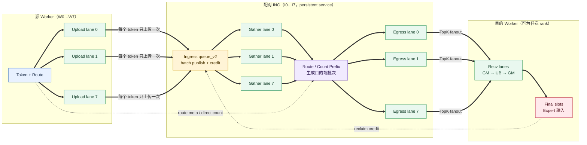
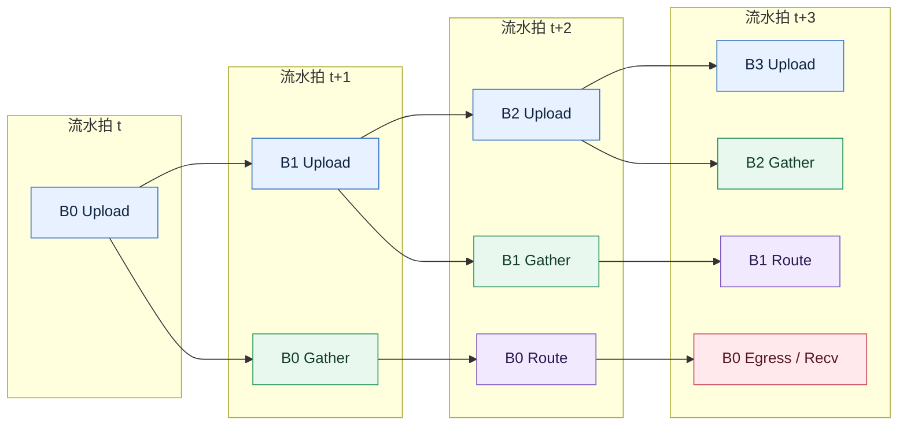
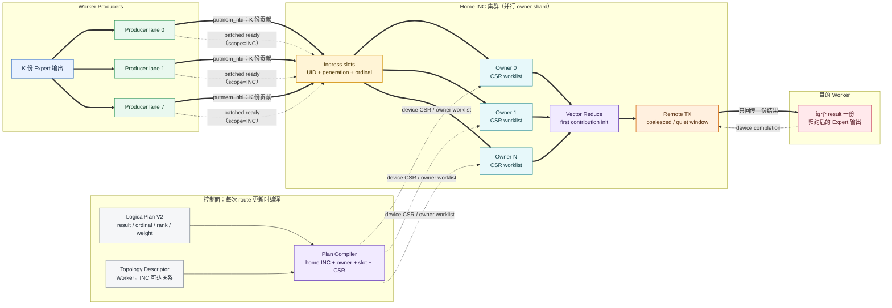
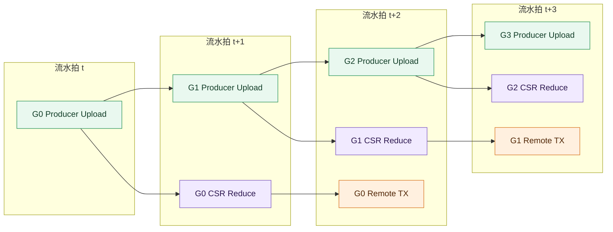

# Multi-INC Dispatch / Combine：设计与当前结果

本文只回答五件事：为什么交叠有收益、Dispatch 和 Combine 如何跑出高带宽、通信库如何保证正确与可扩展、当前性能如何、还有什么限制。

## 1. 一页结论

Multi-INC 使用 `W` 个 Worker 和 `W` 个配对 INC。每个 Worker 先与自己的 INC 通信，INC 再完成路由或归约后的发送，不需要 INC 之间转发。

| 项目 | 当前结论 |
|---|---|
| Combine 锁定形状 | 176.6–185.5 GB/s，全部低于 192 GB/s 物理审计线 |
| Dispatch | 新候选在 W8 大消息上：K1 为 152.8–153.5 GB/s；K2 为 161.5–162.2 GB/s；K4/K6/K8 为 160.2–168.5 GB/s |
| 完全交叠 | 新 Dispatch lineage 的 canonical gate：并发耗时为串行的 52.1%；soak100 典型值为 68.0% |
| 部分交叠 K8 | 48 个总样本中的 K8 子集 24/24 正确；并发耗时中位约为串行的 68.3%–88.3% |
| 部分交叠 K4/T512 | 24/24 正确；部分点约为串行的 85%–105%，小余量形状不保证获益 |
| 工程状态 | **CONDITIONAL**：host C ABI 和运行时规划已具备，production device backend 与跨型号实机证明仍未完成 |

性能口径固定为：

```text
makespan       = max(rank_us)
useful_gbps    = useful_bytes / makespan_us / 1000
formal result  = min(useful_gbps across samples)
```

其中 Dispatch 的 `useful_bytes` 是 `accepted_route_instances × hidden × dtype_bytes`；稠密 TopK 等价于 `W × tokens × K × hidden × 2`。K>1 时必须计算全部 K 份成功交付的数据，不能只计算输入 tensor 一次。Combine 同样按 K 份实际输入贡献计算。

为避免“实际传输”产生歧义，报告同时区分三个量：

```text
Dispatch upload bytes   = S
Dispatch download bytes = K × S      # useful_bytes / 带宽分子
Dispatch wire total     = (K + 1)×S  # 仅作流量诊断
```

网络是全双工的，上下行分别受 192 GB/s 约束；不能把 `(K+1)×S` 的上下行总和除以时间，再拿结果与单方向 192 GB/s 比较。

发生错误、超时、计时不完整或计算值超过 192 GB/s 时，带宽无效，不能用于晋升。

2026-07-30 的 metric-v2 修正只重算带宽分子：原始 rank timing、正确性、retention、overlap gain、lineage 和冻结文件均保持不变。展示层将原始 `gain` 换算为 `time_ratio_pct = 100 / gain`，不修改原始测量。旧交付 gate 作为原始证据保留，绝对 Dispatch GB/s 以 `dispatch_transferred_bytes_metric_v2_gate.json` 及其派生 gate 为准。

随后完成的 150–160 GB/s Dispatch 候选仍未替换默认路径。它把 raw descriptor ring 扩到最大合法 epoch 可证明的容量，在热点 chunk 内持续发布 staging tail，并用 route 容量与最大 destination 占比选择 source-major 快路径或 dest-major 安全回退。K>1 的 canonical ordinal 按 16 KiB transport window 分块发布，消除了跨窗口别名；epp=8 使用 shift/mask specialization，其他布局保留通用回退。候选完整结论见 `report/dispatch_150_160_candidate_gate.json`。

## 2. 为什么 Dispatch 与 Combine 可以交叠

对完全均衡的 TopK 路由，设一份源 token 数据为 `S_d`，一份 Combine 输出为 `S_c`：

| 操作 | 上行流量 | 下行流量 | 主压力方向 |
|---|---:|---:|---|
| Dispatch | `S_d` | `K × S_d` | 下行 |
| Combine | `K × S_c` | `S_c` | 上行 |

Dispatch 把一份输入上传一次，再向 K 个目的端分发；Combine 收集 K 份贡献，再返回一份归约结果。因此两者对全双工网络的压力方向互补：Dispatch 的下行可以与 Combine 的上行同时工作。

### 2.1 网络纯流量模型

上、下行各按独立的 192 GB/s 资源计算。若第一个操作在 `t=0` 开始，第二个在 `δ` 后开始，则某一方向的理想完成时间为：

```text
T_dir = max(
    first_bytes / B,
    δ + second_bytes / B,
    (first_bytes + second_bytes) / B
)

T_network = max(T_upload, T_download)
time_ratio_network = T_network /
    (T_dispatch_network + T_combine_network) × 100%
```

三项分别是第一个操作、第二个操作的释放时间约束，以及该方向总字节数的容量下界。`time_ratio_network` 越低越好：100% 表示没有节省，68% 表示并发后耗时是串行的 68%，即节省 32%。

完全均衡、两个算子数据规模相同且 `TopK=N` 时：

```text
Dispatch 串行时间 = N×S/B
Combine  串行时间 = N×S/B
并发网络时间      = (N+1)×S/B

time_ratio_theory = (N+1)/(2N) × 100%
```

因此 N=8 时纯网络理论值为 **56.25%**；N 越大，该值越接近 50%。这个模型不包含 kernel launch、ready/credit、归约计算和设备调度，因此它是网络流量参考值，不是端到端实测值的强制边界。

实测使用设备时间窗：

```text
T_actual = union(dispatch interval, combine interval)
time_ratio_actual = T_actual /
    (dispatch solo envelope + combine solo envelope) × 100%
```

实测比例可能低于网络理论比例，因为并发还可能隐藏控制和调度开销；也可能更高，因为两个服务会争抢 AIV、HBM 或调度时隙。两者不是同一基线，不能互相冒充。

### 2.2 部分交叠结果

偏移不是写死的微秒数，而是用首发操作的 solo 中位时间动态计算。每个点重复 3 次；两组共 48/48 正确、0 timeout、0 个超物理结果。

主形状：

```text
W8 / I8 / K8
Dispatch: T1024, H4096, E1
Combine : R512, H7168, E20, owner14
```

| 首发 | 第二个启动点 | 网络纯流量完成时间 | 实测完成时间中位 | 网络耗时占比 | 实测耗时占比中位（最差） |
|---|---:|---:|---:|---:|---:|
| Dispatch | 0 | 6466 µs | 6896 µs | 72.55% | 68.81%（68.86%） |
| Dispatch | 1/3 | 7278 µs | 7661 µs | 81.65% | 76.45%（83.99%） |
| Dispatch | 1/2 | 7858 µs | 8331 µs | 88.16% | 83.13%（87.87%） |
| Dispatch | 2/3 | 8438 µs | 8844 µs | 94.67% | 88.25%（88.50%） |
| Combine | 0 | 6466 µs | 6943 µs | 72.55% | 69.28%（70.67%） |
| Combine | 1/3 | 6466 µs | 6910 µs | 72.55% | 68.95%（69.23%） |
| Combine | 1/2 | 6466 µs | 6841 µs | 72.55% | 68.26%（69.12%） |
| Combine | 2/3 | 7156 µs | 7938 µs | 80.29% | 79.20%（79.69%） |

这里 Combine solo 约 6541 µs，Dispatch solo 约 3482 µs。Combine 先发到 1/2 时，Dispatch 仍能大部分藏在 Combine 尾部，所以收益与同启接近；反向延迟会更快损失重叠窗口。

补充形状 `W8/I8/K4 + Dispatch T512 + Combine R512/H7168/E20` 的网络理论耗时占比最低约 86%。实测中位约为串行的 85%–105%，部分样本超过 100%，即并发反而更慢。结论是：库应允许任意时刻并发，但调度器只应在预测节省足以覆盖固定开销时主动交叠；小余量形状默认串行更稳妥。

## 3. Dispatch 如何实现高带宽

下图中，粗实线是 payload 数据流，虚线是控制与 credit。每个 Worker 只把 token 上传给配对 INC 一次；TopK 扩散发生在 INC 的 egress 侧。



稳定态不是“一个 batch 完成后再开始下一个”，而是不同 batch 同时占据不同流水级：



核心不是增加一次转发，而是把上传、路由、发送和接收拆成持续工作的流水段：

1. **源数据只上传一次**：source-major raw layout 避免按 TopK 重复上传；TopK 扩散在 INC 侧完成。
2. **队列化解耦**：queue_v2 使用深环形队列、批量发布和 credit reclaim，使 upload、gather、egress、recv 不必逐 token 同步。
3. **多 lane 并行**：Worker upload/recv 与 INC gather/egress 各自分 lane，让不同通道同时推进。
4. **批量数据搬运**：tile 化的 GM→UB→GM 和批量 egress 降低小事务比例。
5. **控制面不进入逐 token 热路径**：direct count exchange、final-slot 落位和模板化 route 元数据减少往返与重排。
6. **元数据窗口化**：大于 16 KiB 的 ordinal wire 分窗口完成，最后一个窗口与 lane-work 合批，兼顾正确性与启动延迟。
7. **可移植 specialization**：常用 epp=8 用 shift/mask 消除逐 route 除法；其他 epp 继续走等价通用路径。
8. **persistent multi-epoch**：常驻服务复用 workspace、队列和 kernel 生命周期，避免每轮重新启动。

在交付矩阵的 W8 可比点中，T1024 的 K1/K2/K4/K6 retention 分别约 1.12/1.32/1.61/1.86；T16 仍是固定开销短板。retention 是时间比，所以字节口径修正前后不变。

按实际交付字节重算后的代表性结果：

| 证据 | 形状/范围 | Dispatch 带宽 |
|---|---|---:|
| 部分交叠 solo | W8/K8/T1024/H4096 | 154.2 GB/s |
| 部分交叠 solo | W8/K4/T512/H4096 | 127.7 GB/s |
| 交付矩阵 | W2/W4/W8，K1/2/4/6/8 | 最高 127.5 GB/s |
| 500-case cartesian | W2/W4/W8，全 tokens/skew | 最高 151.9 GB/s |
| 150–160 最终候选 | W8/K1/T4096/H4096，5 次 | 152.8–153.5 GB/s |
| 150–160 最终候选 | W8/K2/T4096/H4096，3 次 | 161.5–162.2 GB/s |
| 150–160 候选 | W8/K4/T2048；K6/K8/T1024 | 160.2–165.8 GB/s |
| 64 KiB route-wire 边界 | W8/K4/T4096；K8/T2048 | 167.3–168.5 GB/s |

前四行是历史证据重算；后三行来自候选 NPU 实测。全部使用 `max(rank_us)`，且低于 192 GB/s。输入 tensor 只上传到配对 INC 一次是实现层优化，但带宽分子必须计算 INC 向目的 Worker 实际发送的 K 份 payload。

## 4. Combine 如何实现高带宽

Combine 反向收集 TopK 贡献。LogicalPlan 只描述“谁为哪个 result 提供第几个贡献”，执行计划再把 result 分配到 home INC 和 owner；因此 TopK 与参与 rank 数彼此独立。



在稳定态，上传、归约和回传也跨 result group 重叠：



高带宽来自把动态 TopK 语义编译成设备可直接执行的流水计划：

1. **LogicalPlan 与物理拓扑分离**：CSR 描述 result、ordinal、contributor 和 weight；compiler 再选择 home INC、owner、slot 和 worklist，不用 `topk≈参与 rank 数` 的错误抽象。
2. **只处理活跃工作**：source-group worklist 和 owner CSR 代替全 source 扫描，稀疏、任意 K 和 K>W 都走同一语义。
3. **并行 producer 与 owner shard**：Worker 分 lane 上传，结果按 owner 分片，多个 INC 同时归约。
4. **ready 摊销**：ready scope 设为 INC，多份 result 合并通知；ordinal bitmap、UID 和 generation 防重复与陈旧消息。
5. **向量归约与直接发送**：first-contribution init、FP16 vector reduce、K1 direct TX 和 remote TX 减少清零、中间拷贝及 host 介入。
6. **persistent device completion**：多 epoch 常驻执行，批量 nbi 后集中 quiet，并由 device completion 结束，不把 host barrier 放进正式时间窗。

锁定 `W8/I8/K8/R512/H7168/E20` 的 4 次交付测量为 176.6–185.5 GB/s。新部分交叠实验的 K8 solo 中位约 179.6 GB/s；K4/T512 配套形状的 Combine solo 约 104.1 GB/s。所有可信值均低于 192 GB/s。

## 5. 通信库层面的鲁棒性与可扩展性

系统按“语义—拓扑—执行—会话—测量”分层，避免把某台机器的 rank、AIV 或 TopK 写进协议：

| 层 | 设计保证 |
|---|---|
| 语义 | CSR 显式记录每个贡献；支持 arbitrary K、K>W、zero/ragged/skew，不用参与 rank 数近似 TopK |
| 拓扑 | Worker/INC 集合和映射由 descriptor/runtime profile 生成；W2/W4/W8 共用协议 |
| 执行 | owner、lane、queue 和 workspace 由 planner 计算并做容量检查；AIV 少时 elastic/time-multiplex/scalar fallback，只允许降性能 |
| 会话 | 独立 UID/generation/ordinal；Dispatch 与 Combine 使用独立 session、stream 和 workspace，可任意先后或并发 |
| 流控 | 有界 queue、credit、ready、quiet 和 completion；资源不足或协议不匹配时 fail-close，不静默覆盖 |
| 接口 | context/plan/request C ABI；异步 dispatch/combine、query/wait/release，便于 Megatron、vLLM 和后续融合算子绑定 |
| 测量 | 单 case 30 秒强杀；错误即 bandwidth=null；makespan 取最慢 rank；192 GB/s 物理上限审计 |

当前 runtime planner 已覆盖 1/20/24/32/40/64 AIV 的 host 测试和 stress100，但这只证明控制面会生成合法 fallback：

```text
production_backend_bound = false
cross_device_proven      = false
```

因此目前不能宣称换一代 Ascend 硬件即可无验证上线。真正 production-ready 还需要将 C ABI 绑定到 device backend，并在每种目标硬件上完成能力探测、正确性矩阵、性能重选型和多 stream smoke。

## 6. 当前建议与证据

- 大 K/大 payload：允许 Dispatch 与 Combine 同启；若 Combine 明显更长，可在其 1/3–1/2 处启动 Dispatch，收益接近完全交叠。
- 小 K/小 payload：先用 `predicted_time_ratio = 1/predicted_gain` 和历史 tail 决定是否并发；预测耗时接近或超过 100% 时不要强制交叠。
- QoS priority 7/0 改善常态，但 soak100 仍出现 Combine service tail，因此保持候选配置，不替换默认路径。
- 交付等级保持 **CONDITIONAL**，不修改 `p100_frozen`，不修改 `default_path_replaced=false`。

关键证据：

- [统一交付 gate](report/multi_inc_delivery_validation_gate.json)
- [Dispatch 实际传输字节口径总审计](report/dispatch_transferred_bytes_metric_v2_gate.json)
- [交付矩阵重算 gate](report/multi_inc_delivery_validation_transferred_bytes_v2_gate.json)
- [500-case 重算 gate](report/multi_inc_dispatch_cartesian_vs_native_transferred_bytes_v2_gate.json)
- [Dispatch 150–160 最终候选 gate](report/dispatch_150_160_candidate_gate.json)
- [新 Dispatch lineage canonical overlap gate](report/canonical_dispatch_combine_overlap_gate.json)
- [锁定状态](report/multi_inc_delivery_conditional_lock_status.json)
- [完全交叠 soak100](report/canonical_overlap_qos_dispatch7_combine0_soak100_gate.json)
- [K8 部分交叠 gate](report/canonical_partial_overlap_k8_qos_gate.json)
- [K4 部分交叠 gate](report/canonical_partial_overlap_k4_qos_gate.json)
- [统一耗时占比派生数据](report/overlap_time_ratio_metric_v3.json)
- [统一耗时占比 CSV](report/overlap_time_ratio_metric_v3.csv)
- 历史 campaign runner 已从交付树移除；当前保留的多 INC 源码入口见
  [`examples/inc/dispatch_combine/multi_inc/README.md`](../../examples/inc/dispatch_combine/multi_inc/README.md)。
- [框架 C ABI](../../examples/inc/dispatch_combine/inc_dc_framework_c_api.h)
