# nb-borrow 单 INC Fusion Kernel 发布候选数据（2026-08-10）

## 结论

本轮冻结的自定义最优路径是 `fused_inc`：ABI 13、单 INC 常驻服务、token-wave 外层流水、
INC 上 Dispatch/Combine 使用独立 AIV cohort，并由 INC 将完整归约结果 fanout 给 worker。
本轮不再修改性能协议，只补充数据和整理交付物。

这是一版可复现实验候选，不是“已经超过原生 vLLM”的生产结论：

- W2/W4、16–1024 token 的 `fused_inc` 全部正常退出，每个 case 的重复输出均稳定。
- W4/512 的 12 次稳定性 gate 为 `82.740 ms`、CV `1.902%`、12 次 token 均为 442。
- W4/128 同 INC 数据面下，`fused_inc` 相对 `serial_inc` 的实测均值比为 `1.102×`；
  但两者都只有一个 token wave，因此这不是纯 D/C 跨 wave 交叠证明，主要混有 strict-serial
  门和同步开销的差异。
- W4/512 相对 native eager 仍慢 `18.12%`，相对生产默认的 native graph 慢 `29.87%`
  （时延为 `1.299×`）；不能宣称端到端已超过原生。
- 新增 28 个同一 1024-token capacity 下的 native graph/eager 场景（每场景 5 次测量）。W4/1024 的
  `fused_inc` 为 `159.042 ms`，native eager/graph 分别为 `71.377/65.732 ms`；大 prefill
  仍有明确端到端差距。
- 同一 prompt 矩阵下，native 与 `fused_inc` 的最终 token ID 不一致。`output_stable=true`
  只证明各路径内部确定性，不证明与原生数值等价；接入真实推理前必须解决这一硬阻塞项。

完整机读数据见 [results.csv](results.csv)，原始 JSON 位于 [raw](raw/)，文件完整性可用
[MANIFEST.sha256](MANIFEST.sha256) 校验。

## 环境与口径

- 主机：`nb-borrow`，16 × Ascend 910B2C，两个 8 卡 HCCS 平面。
- 平面 A 容器：`montyyin_inc_vllm_0191`，物理 NPU `0..4`。
- 平面 B 容器：`montyyin_inc_vllm_0191_planeb`，容器局部 NPU `0..4` 对应物理 `8..12`。
- 模型：`Qwen3-30B-A3B`，BF16；另补原生 `Qwen3-30B-A3B-w8a8` 参考。
- vLLM / vLLM-Ascend：0.19.1；CANN 8.5.1；PyTorch / torch-npu 2.9.0。
- 自定义路径默认 eager；因此同时报告 native eager（执行模式参考）和 native graph
  （真实生产外部基线）。
- 所有运行前后均用 `npu-smi info` 确认全机无其他 NPU 进程；失败 case 只重启本项目的
  隔离容器回收驱动上下文。

## 四条自定义路径

| 路径 | 数据路径 | 调度 |
|---|---|---|
| `serial_shmem` | worker → worker | D → FFN → C 严格串行 |
| `fused_shmem` | worker → worker | token-wave 流水 |
| `serial_inc` | worker → INC → worker | D → FFN → C 严格串行 |
| `fused_inc` | worker → INC → worker | token-wave 流水；当前最优交付路径 |

`native_vllm` 是外部参考，不属于四格因子矩阵。本轮当前代码中，direct-SHMEM 两格在
小/中/大容量都于模型加载后的 vLLM shared-memory RPC 阶段失联。精确 heap 查询显示
W4 全局容量 32/128/512 分别只需要
512/512/638 MiB 对称堆，因此该故障不是 HBM 不足或“任意数据量”协议限制。

## 当前最优路径 sweep

以下均为 batch 1、输出 1 token 的完整请求时延。16/64/256/1024 使用全局容量 1024，
32/128/512 使用全局容量 512，证明同一 prepared capacity 能接受任意不超过容量的实际
token 数；协议没有要求整除或 2 次幂，部署只需为 engine 的最大 token budget 准备容量。

| input token | W2 mean / CV | W4 mean / CV | W2÷W4 时延比 |
|---:|---:|---:|---:|
| 16 | 70.101 ms / 1.349% | 73.614 ms / 4.064% | 0.952× |
| 32 | 68.923 ms / 0.154% | 72.573 ms / 0.318% | 0.950× |
| 64 | 70.995 ms / 6.029% | 73.193 ms / 3.790% | 0.970× |
| 128 | 68.429 ms / 0.085% | 73.497 ms / 3.156% | 0.931× |
| 256 | 98.123 ms / 0.104% | 80.879 ms / 0.150% | 1.213× |
| 512 | 122.537 ms / 0.193% | 81.819 ms / 0.274% | 1.498× |
| 1024 | 215.492 ms / 0.587% | 159.042 ms / 0.098% | 1.355× |

小输入由固定启动/同步开销主导，W4 不占优；从 256 token 起，更多 expert worker 带来
可见扩展收益。W4/1024 的 5 次时延为 158.826–159.231 ms，说明大输入主路径稳定。

## 与 native vLLM 的公平比较

这里的“相对速度”定义为 `native_time / fused_inc_time`；小于 1 表示 `fused_inc` 更慢。

| token | fused INC eager | native eager | 相对 native eager | native graph | 相对 native graph |
|---:|---:|---:|---:|---:|---:|
| 32 | 72.573 ms | 71.582 ms | 0.986×（慢 1.38%） | 31.109 ms | 0.429× |
| 128 | 73.497 ms | 68.411 ms | 0.931×（慢 7.43%） | 34.279 ms | 0.466× |
| 512 | 81.819 ms | 69.268 ms | 0.847×（慢 18.12%） | 62.998 ms | 0.770× |

native graph 是部署时应采用的主要 baseline；native eager 仅用于拆分 graph/compile 的影响。
两者使用相同 `max_num_batched_tokens=512`，不能把 native graph 优势算作通信算法收益。

### 1024-token capacity 扩展对比

为覆盖更大 prefill，本轮又在两个独立 HCCS 平面并行完成 W2/W4 的 native graph 和 eager
七点 sweep。下表只列与 `fused_inc` 扩展 sweep 同为 `max_num_batched_tokens=1024` 的
16/64/256/1024 四点，避免把不同 prepared capacity 混在一个比值中。“相对速度”仍为
`native_time / fused_inc_time`。

| rank | token | fused INC | native eager | 相对 eager | native graph | 相对 graph |
|---:|---:|---:|---:|---:|---:|---:|
| W2 | 16 | 70.101 ms | 70.315 ms | 1.003× | 36.951 ms | 0.527× |
| W2 | 64 | 70.995 ms | 69.434 ms | 0.978× | 35.916 ms | 0.506× |
| W2 | 256 | 98.123 ms | 67.811 ms | 0.691× | 46.259 ms | 0.471× |
| W2 | 1024 | 215.492 ms | 77.899 ms | 0.361× | 76.983 ms | 0.357× |
| W4 | 16 | 73.614 ms | 74.227 ms | 1.008× | 30.657 ms | 0.416× |
| W4 | 64 | 73.193 ms | 70.279 ms | 0.960× | 28.986 ms | 0.396× |
| W4 | 256 | 80.879 ms | 69.898 ms | 0.864× | 36.264 ms | 0.448× |
| W4 | 1024 | 159.042 ms | 71.377 ms | 0.449× | 65.732 ms | 0.413× |

小输入下 `fused_inc` 与 native eager 接近，W2/W4 的 16-token 点分别略快 `0.30%/0.83%`；
从 64 token 起均未超过 eager，且差距随大 prefill 扩大。graph 路径在全部点上更快。
28 个新增场景的每次测量均 `output_stable=true`；W2 graph/64 的 CV 为 `11.97%`、W4
eager/128 为 `9.31%`，属于需要复测的高抖动点，报告保留原始样本而不筛除尾延迟。

### 数值正确性边界

W4 BF16 的 32/128/512 矩阵使用相同 seed、相同 scenario 顺序和相同 greedy sampling，但最终
token 分别为：

| token | native graph | fused INC |
|---:|---:|---:|
| 32 | 198 | 450 |
| 128 | 11 | 67 |
| 512 | 82 | 2220 |

因此当前数据只支持“自定义路径内部输出稳定”和“同配置 serial/fused 输出一致”，不支持
“与 native 数值等价”。这必须作为生产接入 gate，而不是通过性能报告淡化。

## 交叠的理论与真实收益

对 N 个 token wave，若三个阶段耗时为 D、F、C，理想串行为
`N(D+F+C)`；忽略资源冲突的理想流水约为
`D+F+C+(N-1)max(D,F,C)`。因此稳态上限是
`(D+F+C)/max(D,F,C)`，最多 3×，并不由 rank 数直接决定。若只讨论 D/C 两阶段，
上限才是 `(D+C)/max(D,C) ≤ 2×`。

```mermaid
gantt
    title token-wave 稳态流水（时间向右）
    dateFormat X
    axisFormat %L
    section INC Dispatch cohort
    D(n+1) :0, 4
    section Worker AIC/AIV
    FFN(n) :2, 5
    section INC Combine cohort
    C(n-1) :5, 4
```

当前可严格同口径比较的是：

| input | wave 数 | serial INC mean | fused INC mean | 实测均值比 | 解释 |
|---:|---:|---:|---:|---:|---|
| 32 | 1 | 76.851 ms | 68.356 ms | 1.124× | 无跨 wave 理论收益；serial CV 9.29%，差值含门控/尾延迟 |
| 128 | 1 | 76.192 ms | 69.130 ms | 1.102× | 无跨 wave 理论收益；差值主要是 strict-serial 同步开销 |

512 token 有两个 worker token wave，但本轮 `serial_inc` 在 engine startup 阶段失联，故没有
伪造“理论收益”或用不同容量数据替代。要证明真正的 D(n+1)∥F(n)∥C(n-1) 收益，必须先让
同容量多 wave serial 对照稳定运行，并采集设备阶段 trace。

## 不同模型/权重模式

完整状态见 [model_compatibility.csv](model_compatibility.csv)。Qwen3 W8A8 原生 graph 已跑通：

| token | BF16 native graph | W8A8 native graph | W8A8÷BF16 时延 |
|---:|---:|---:|---:|
| 32 | 31.109 ms | 31.155 ms | 1.001× |
| 128 | 34.279 ms | 34.167 ms | 0.997× |
| 512 | 62.998 ms | 77.693 ms | 1.233× |

`fused_inc` 对 W8A8 明确 fail-closed：当前 bridge/kernel 只资格化 BF16 未量化权重，错误为
`NotImplementedError: the first single-INC qualification is BF16 unquantized`。这属于未实现的
量化语义，不是性能 FAIL。DeepSeek/GLM 的本地 checkpoint 同时改变架构、hidden、expert
数和量化方式，不能用当前写死的 Qwen3 runner 参数冒充跨模型结果。

## 发布边界

- 保留：ABI 13 源码、单 INC 当前实现、结构化报告与当前 JSON。
- 删除/不归档：launcher stdout/stderr、PID/READY/control 文件、临时 profile、`.orig`、
  `__pycache__` 和失败进程转储。
- 当前阻塞：native 数值不一致；direct-SHMEM/大容量 serial INC 的 vLLM lifecycle；
  W8A8 kernel 未实现；INC 路径尚未做到 production native graph replay-safe。
- 当前可用：BF16 Qwen3、W2/W4、单 INC、实际 token `0..prepared capacity`、eager 路径的
  功能/稳定性实验与 API 集成验证。

环境重建和精确命令见
[RUNBOOK_NB_VLLM.md](../../../../../examples/inc/fusion_kernel/framework/vllm_ascend/RUNBOOK_NB_VLLM.md)。
