# 单 INC Fusion Kernel

本目录现在包含一套可构建、可运行的昇腾单 INC 融合原型。主路径是一个 worker
MIX kernel 加一个 INC vector service kernel：

```text
INC-Dispatch(token-wave i+1)
          ∥ GMM1 → SwiGLU(row-slice) → GMM2(token-wave i)
          ∥ INC-Combine(token-wave i-1)
```

它不是 `dispatch_combine/single_inc` 的替代品；后者仍是独立 Dispatch/Combine 的正式
带宽与 gate 基线。本实现用于验证把 D、FFN、C 放进同一 kernel 后的流水与真实 D∥C
收益，并提供 prepared API 供推理框架接入。

## 理想 token-wave timeline

`Dᵢ`、`Fᵢ`、`Cᵢ` 分别表示 wave `i` 的 INC Dispatch、
`GMM1 → SwiGLU → GMM2` 和 INC Combine，且严格满足 `Dᵢ → Fᵢ → Cᵢ`。
图中每格是抽象时隙，不表示真实阶段等长。

### 两个 token wave：只有填充/排空，尚无 D 与 C 同时重叠

```mermaid
gantt
    title 两个 token wave 的理想流水
    dateFormat X
    axisFormat %L
    section INC Dispatch cohort
    D0 :d0, 0, 1
    D1 :d1, 1, 1
    section Worker FFN
    F0 :f0, 1, 1
    F1 :f1, 2, 1
    section INC Combine cohort
    C0 :c0, 2, 1
    C1 :c1, 3, 1
```



两个 wave 只有填充/排空，不存在 `D(n+1) ∥ C(n-1)`，不能把总时延差全部归因于
单 INC 上下行交叠。

### 四个 token wave：进入 D、F、C 三段稳态交叠

```mermaid
gantt
    title 四个 token wave 的理想流水
    dateFormat X
    axisFormat %L
    section INC Dispatch cohort
    D0 :d0, 0, 1
    D1 :d1, 1, 1
    D2 :d2, 2, 1
    D3 :d3, 3, 1
    section Worker FFN
    F0 :f0, 1, 1
    F1 :f1, 2, 1
    F2 :f2, 3, 1
    F3 :f3, 4, 1
    section INC Combine cohort
    C0 :c0, 2, 1
    C1 :c1, 3, 1
    C2 :c2, 4, 1
    C3 :c3, 5, 1
```



若共有 `N` 个 wave，三阶段串行时间为 `N(D+F+C)`，理想流水时间近似
`D+F+C+(N-1)·max(D,F,C)`；实际收益还会受 packet、credit、最慢 rank、AIC/AIV 争用和
首尾排空影响。设备 trace 与墙钟必须同时报告，不能只凭示意图宣称收益。

## 代码入口

- 设计与验收准则：[`PRINCIPLES.md`](PRINCIPLES.md)
- C prepared API：[`ascend/inc_fusion_api.h`](ascend/inc_fusion_api.h)
- 五后端 benchmark 契约：[`ascend/inc_fusion_benchmark.h`](ascend/inc_fusion_benchmark.h)
- vLLM-Ascend 接入契约：[`framework/vllm_ascend/README.md`](framework/vllm_ascend/README.md)
- host plan / workspace：[`ascend/inc_fusion_plan.h`](ascend/inc_fusion_plan.h)
- 动态路由编译：[`ascend/inc_fusion_route.h`](ascend/inc_fusion_route.h)
- 设备 dense-topk 路由打包：[`ascend/inc_fusion_route_pack.h`](ascend/inc_fusion_route_pack.h)
- Torch NPU 原生桥接：[`framework/vllm_ascend/native/README.md`](framework/vllm_ascend/native/README.md)
- worker/INC kernel：[`ascend/inc_fusion_kernel.cpp`](ascend/inc_fusion_kernel.cpp)
- 完整 API 示例：[`examples/README.md`](examples/README.md)
- case timeline 解析器：[`tools/README.md`](tools/README.md)
- 端到端验证：[`ascend/tests/inc_fusion_e2e_main.cpp`](ascend/tests/inc_fusion_e2e_main.cpp)
- 当前 ABI 13 发布候选：[`../../../docs/inc/report/nb-borrow/fusion_kernel_release_20260810/README.md`](../../../docs/inc/report/nb-borrow/fusion_kernel_release_20260810/README.md)
- 当前 ABI 13 算子资格化：[`../../../docs/inc/report/nb-borrow/fusion_kernel_qualified_path_20260811/README.md`](../../../docs/inc/report/nb-borrow/fusion_kernel_qualified_path_20260811/README.md)
- 清理后发布验证：[`../../../docs/inc/report/nb-borrow/release_validation_20260811/README.md`](../../../docs/inc/report/nb-borrow/release_validation_20260811/README.md)
- nb 可复现实验手册：[`framework/vllm_ascend/RUNBOOK_NB_VLLM.md`](framework/vllm_ascend/RUNBOOK_NB_VLLM.md)

## 对外 API 怎么选

普通推理接入使用 `inc_fusion_worker_executor_*` 与 `inc_fusion_remote_service_*`。
plan、workspace 和 INC service 只初始化一次；tensor、route、weight、stream 由调用方持有。

| 位置 | 初始化/准备 | 热路径 | 释放 |
|---|---|---|---|
| 所有 PE | `inc_fusion_plan_desc_init` → `inc_fusion_prepared_plan_create` → `inc_fusion_prepared_plan_info` | 无 | `inc_fusion_prepared_plan_destroy` |
| Worker | `inc_fusion_worker_executor_create` | `inc_fusion_worker_executor_enqueue` | `inc_fusion_worker_executor_destroy` |
| 远端 INC | `inc_fusion_remote_service_create` → W+1 setup barrier → `inc_fusion_remote_service_start` | 常驻 service 从对称 descriptor ring 收请求，无逐请求 host launch | `inc_fusion_persistent_service_stop/destroy` |
| 同进程实验 INC | `inc_fusion_persistent_service_create` | `submit` → `query` | `stop` → `destroy` |

`inc_fusion_prepared_build_args/enqueue` 是更底层的零分配接口。`token_count` 表示容量，
每次请求的实际 token 数由 `active_token_counts` 描述。

## 解析一个真实 case 的 timeline

当前 trace 只有整次 kernel 的角色 span、INC D/C 聚合窗口和相对 checkpoint，不能还原
逐 wave 绝对甘特图。解析器会重算 overlap、理论上限和真实 window speedup。

```bash
python3 examples/inc/fusion_kernel/tools/parse_fusion_timeline.py \
  /path/to/case/pe*.log \
  --format markdown \
  --strict \
  -o /tmp/fusion_timeline.md
```

完整参数见 [`tools/README.md`](tools/README.md)。`actual_vs_theoretical_pct` 仅表示
**D/C 聚合服务窗口效率**；端到端结论仍须比较所有 worker 的 makespan。

## 当前实现

- 当前协议 ABI 为 13；发布候选固定为 BF16 `fused_inc`，不再在运行时遍历协议参数。
- W 是运行时参数；当前 nb 资格化只使用同一 HCCS 平面的 W2/W4，未写死物理卡号。
- Dispatch 对 `(source token, destination rank)` 去重 hidden，保留全部 expert assignment。
- Combine 中每个 expert-instance 独立发送，INC 以 BF16 输入、FP32 tile 算术做加权归约并回传。
- INC 48 个 AIV 固定分成 24 Dispatch + 24 Combine；worker 为 8 Dispatch + 8 Combine + 32 activation，24 个 AIC 执行两次 GMM。
- 外层固定为 token-wave；内部默认把每个 expert 的行切成 2 个 activation slice，以 generation line 做 AIC/AIV 交接。GMM2 每完成一个 slice，Combine AIV 就立即发送该 slice，不再等待整波 FFN 完成。
- 四套传输队列彼此独立，固定深度，内存不随总 token 数增长；payload 可切成多个 16KiB packet。
- packet 使用 metadata → quiet → 64-bit commit 两阶段发布，credit 返回精确 commit；接收元数据每项独占一个 cacheline。
- `inc_fusion_prepared_enqueue` 不分配、不解释路由、不查询拓扑、不做 host 同步。
- dense top-k route-pack 已在设备完成：count 使用稳定标量入口，pack 对小输入使用单 AIV、
  对中大 regroup 工作使用确定性多 AIV analyze/prefix/emit；EP 组只做一次
  `[wave_capacity,E+1]` int32 all-gather；额外一列携带各 rank 的真实 token 数，因而
  不需要 `.cpu()`、`argsort`、第二次 collective 或 `.item()`。
- prepared plan 是容量桶，实际 token 数可以小于容量；尾部 wave 是合法空 wave。
  ABI v6 允许每个 worker 的 active-token 数不同，INC 按 source 的真实长度回传，
  不会写出短 rank 的 output 边界。
- `inc_fusion_persistent_service_create/submit/query/stop` 提供常驻 INC descriptor ring：INC kernel 只启动一次，submit 不分配且按 64-bit ticket 有序发布，ring 满显式返回 `INC_FUSION_BUSY`。
- `inc_fusion_remote_service_create/start` 与 worker executor 构成 W+1 跨进程热路径：动态
  generation、ticket、waves 和 active-token 向量合成一个连续 wire record，INC 收齐所有
  worker readiness 后才开始该 ticket；descriptor ready/complete 与 packet ready/credit 都
  使用精确代际，service ring 回卷不需要全量清零 queue。
- `INC_FUSION_EXEC_SERIALIZE_INC_DC` 仅用于严格交替压力对照；纯 D∥C 收益以设备 trace 的服务窗口口径报告。

### 常驻 INC 调用顺序

```c
inc_fusion_persistent_service_t *service = NULL;
inc_fusion_persistent_service_create(
    plan, symmetric_base, 4, service_stream, &service);

// device_args 必须是 INC role，且其准备/拷贝与 submit 在同一 stream，
// 或由调用方建立明确的 event dependency。
uint64_t ticket = 0;
inc_fusion_persistent_service_submit(
    service, device_args, request_id, submit_stream, &ticket);

inc_fusion_service_result_t result = {0};
inc_fusion_persistent_service_query(service, ticket, &result);

inc_fusion_persistent_service_stop(service);
inc_fusion_persistent_service_destroy(service);
```

常驻 kernel 占用 INC 的全部 live AIV。启动之后，不得再在 INC 上发起需要 AIV 的
device collective；跨请求顺序由 descriptor ticket、packet generation 和精确 credit
保证。一个请求进入 push-only 协议后必须正常收齐，`stop` 不是强制取消接口。

跨进程模式必须先在全部 PE 上完成对称 heap/control mirror 初始化并做一次 setup barrier，
再由 INC 调用 `inc_fusion_remote_service_start`。worker 热路径只调用
`inc_fusion_worker_executor_enqueue`；rank 0 发布 wire record，所有 worker 发布 readiness，
不需要逐请求 host collective。

## 构建

```bash
source /usr/local/Ascend/cann-9.1.0-beta.3/set_env.sh
cmake -S . -B /tmp/shmem-build-fusion \
  -DUSE_EXAMPLES=ON -DCMAKE_BUILD_TYPE=Release -DSOC_TYPE=Ascend910B
cmake --build /tmp/shmem-build-fusion --target \
  inc_fusion_plan_tests inc_fusion_benchmark_tests inc_fusion_api_tests \
  inc_fusion_compute_tests inc_fusion_e2e -j8
```

运行前必须用 `npu-smi info` 确认目标卡无其他进程。nb 推荐映射：

```text
W2: PE0→NPU1, PE1→NPU2, INC PE2→NPU0
W4: PE0→NPU1, PE1→NPU2, PE2→NPU3, PE3→NPU4, INC PE4→NPU0
```

这些只是 nb 的运行 profile；kernel/API 不依赖这些编号，其他机器通过 `worker_pes` 和
`INC_PE_TO_NPU_MAP` 提供自己的映射。

## 已知边界

- Worker 当前仍为每请求一次 MIX kernel；INC 已支持跨进程、跨请求常驻
  descriptor-ring server。ring 缓冲待处理请求，但按设计同一时刻只执行一组 D+C，避免
  多组请求争抢 24/24 AIV 而降低当前请求性能。nb 上最小 ring=2 的 W2/W4 已分别连续
  100 次通过；Torch worker executor 已提供显式 setup/out/teardown，INC sidecar 的 engine
  launcher 绑定仍在进行。
- 路由 C++ `std::vector/map` 实现现在只作为 golden/reference。生产路径由
  `route_count_out + 一次元数据 all-gather + route_pack_out` 写入 prepared device
  buffers；协议表已在 CANN 8.5 的 vLLM 容器和宿主 CANN 9.1 环境分别构建验证。
- `operation_generation + wave_count` 必须不超过 32 位；达到上限需重建/清零会话，避免 commit epoch 混叠。
- INC 多 packet reduce 对单 tile 保留低固定开销路径；跨多个 1024-element tile 时使用两套 UB 和 `MTE3_MTE2` 生命周期事件做 ping-pong，允许搬运、向量归约与回写流水重叠。
- 当前编译期安全上限为 64 个 live AIV（由设备侧固定栈数组和 4KiB trace 布局决定）；plan/API 会显式拒绝更大的设备，而不是静默越界。迁移到 AIV>64 的新芯片时需要先扩展 ABI 布局。
- 大 shape 的报告会明确区分“全量 golden”和“抽样 token golden”；抽样不能替代最终全量资格化。
