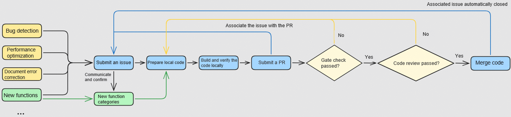

# Contribution Guide

Developers are welcome to experience and contribute to this project. Before contributing to the community, please refer to the [cann-community](https://gitcode.com/cann/community) to understand the code of conduct, sign the CLA, and learn about the contribution process of the source code repository.

Developers need to pay special attention to the following points when preparing local code and submitting PRs:

1. When submitting a PR, fill in the business background, purpose, and solution of the PR carefully based on the PR template.
2. If your changes are not simple bug fixes, but involve adding new features, interfaces, configuration parameters, or modifying code flows, please discuss the design through an issue first to avoid rejection. If you are not sure whether the modification can be classified as a simple bug fix, you can submit an issue for discussion.

Developer contribution scenarios include:

- Fixing function bugs

  If you find some function bugs in this project and want to fix them, feel free to create an issue for feedback and tracking.

  You can create a `Bug-Report` issue to describe the bug according to [Submitting and Handling Issues](https://gitcode.com/cann/community#submitting-and-handling-issues). Then enter `/assign` or `/assign @yourself` in the comment box to assign the issue to yourself for handling.

- Optimizing functions

  If you have ideas for improving the performance of certain function or API implementations in this project and want to implement these optimizations, you are welcome to contribute.

  You can create a `Requirement` issue to describe the optimization points and provide your design solution according to [Submitting and Handling Issues](https://gitcode.com/cann/community#submitting-an-issue/handling-an-issue-task).
  Then enter `/assign` or `/assign @yourself` in the comment box to assign the issue to yourself for handling.

- Contribute new APIs

  If you find an unsupported API and want to develop and implement it, you are welcome to propose new ideas and designs in an issue.

  You can create a `Requirement` issue to describe a new API and design solution according to [Submitting and Handling Issues](https://gitcode.com/cann/community#submitting-and-handling-issues). Project members will communicate with you and provide a proper `contrib` directory category for the API. You can contribute your new API to the corresponding directory.

  In addition, you need to comment `/assign` or `/assign @yourself` in the submitted issue to claim the issue and complete the new API submission.

- Reporting document errors

  If you find any errors in API documents of this project, feel free to create an issue for feedback and correction.

  You can create a `Documentation` issue to point out the problem in the document according to [Submitting and Handling Issues](https://gitcode.com/cann/community#submitting-and-handling-issues). Then enter `/assign` or `/assign @yourself` in the comment box to assign the issue to yourself for handling.

- Helping with others' issues

  If you have a solution for someone else's Issue, please share it in the comments to help the community.

  If the issue requires code modification, you can enter `/assign` or `/assign @yourself` in the comment box to assign the issue to yourself for assisted handling.

  ## Understanding Code of Conduct

  SHMEM is part of the CANN open project. Before contributing, please familiarize yourself with the [CANN Code of Conduct](https://gitcode.com/cann/community/blob/master/contributor/code-of-conduct.md). Your subsequent activities in the SHMEM project (including but not limited to commenting, submitting issues, and editing Wikis) must comply with this Code of Conduct.

  ## Signing CLA

  You must sign a Contributor License Agreement (CLA) before you can contribute to the community.

  Please choose the appropriate CLA based on your participation status: Corporate, Corporate Contributor, Individual, or Enterprise Admin. Click [here](https://clasign.osinfra.cn/sign/68cbd4a3dbabc050b436cdd4) to sign.

  - Corporate CLA: For contributions made on behalf of a corporate. A representative of the corporate should sign this CLA, typically an administrator.
  - Corporate Contributor CLA: If you are an employee of a corporate that has already signed a Corporate CLA, apply to sign this Corporate Contributor CLA. Select your corporate on the application page. The application will be reviewed and approved by the enterprise administrator, after which you can participate in contributions.
  - Individual CLA: For contributions made as an individual who is not a corporate employee.
  - Enterprise Administrator CLA: If you are an enterprise administrator, sign this CLA. Enterprise administrators have the authority to review and approve applications for signing the Corporate Contributor CLA and manage personnel.

  ## Contribution

  After signing the CLA, you can begin your contribution journey. Your contribution can be in many ways and will be highly valued.

  All discovered issues or new ideas you wish to contribute can be discussed and tracked through [Issues](#submitting-and-handling-issues), and can be closed after you [Contributing Code](#contributing-code) via pull requests.

  > 📝 **Note**
  >
  > - For details about the GitCode workflow, see [GitCode Workflow Guide](https://gitcode.com/cann/community/blob/master/contributor/gitcode-workflow.md).
  > - If you encounter any problem when submitting a PR, see [FAQs](https://gitcode.com/cann/infrastructure/blob/main/docs/FAQ/infra-faqs.md) for solutions.

  ### Contribution Categories

  - Fixing bugs

    If you discover a bug in an operator within this repository and wish to fix it, create a new issue in the repository for feedback and tracking.

    You can follow the instructions in [Submitting and Handling Issues](#submitting-and-handling-issues) to create a `Bug-Report` type issue describing the bug.
    Enter `/assign` or `/assign @yourself` in the comment box to assign the issue to you for processing.

  - Optimizing performance

    If you have ideas for improving generalization or performance of existing functions in this repository and want to implement these optimizations, you are welcome to contribute.

    You can follow the instructions in [Submitting and Handling Issues](#submitting-and-handling-issues) to create a `Requirement` type issue describing your idea.
    Then enter `/assign` or `/assign @yourself` in the comment box to assign the issue to yourself for handling.

  - Contributing new features

    If you have an entirely new operator that you want to design and implement on Ascend chips, propose your ideas and design in an issue, and discuss them with the Ascend team.

    You can follow the instructions in [Submitting and Handling Issues](#submitting-and-handling-issues) to create a `Requirement` type issue to provide your new function description and design solution.
    The Ascend team will communicate with you for confirmation and assign an appropriate `contrib` directory for your function. You can then contribute your new function to that directory.

    In addition, you need to comment `/assign` or `/assign @yourself` in the submitted issue to claim the issue and complete the new function submission.

  - Reporting document errors

    If you discover errors in documentation within the repository, create a new issue in the repository for feedback and correction.

    You can follow the instructions in [Submitting and Handling Issues](#submitting-and-handling-issues) to create a `Documentation` type issue to point out the errors.
    Enter `/assign` or `/assign @yourself` in the comment box to assign the issue to you for correcting the documentation.

  - Helping with others' issues

    If you have a solution for someone else's Issue, please share it in the comments to help the community.

    If the issue requires code modification, you can enter `/assign` or `/assign @yourself` in the comment box to assign the issue to yourself for assisted handling.

  ### Submitting and Handling Issues

  - Finding the issue list

    In the [SHMEM](https://gitcode.com/cann/shmem) project homepage on GitCode, click `Issues` to find the issue list.

  - Submitting an issue

    If you want to report a bug, submit a requirement, or send your feedback to the community, please submit an issue.

    For details about how to submit an issue, see [Issue Submission Guide](https://gitcode.com/cann/community/blob/master/contributor/issue-operation.md).

  - Participating in issue discussions

    Each issue is open for developers to communicate and discuss. If you are interested, you can share your thoughts in comments.

  - Finding an issue you want to handle

    If you want to handle one of the issues, you can assign it to yourself. You only need to enter `/assign` or `/assign @yourself` in the comment box. The bot will assign the issue to you and your name will be displayed in the assignee list.

  ### Contributing Code

  1. CANN development environment setup

     If you want to contribute code, you need to set up the CANN development environment. For details, see [Environment Setup](./README_en.md#3-environment-setup).

  2. SHMEM Development Precautions

     (1) For details about the environment and tool requirements for code contribution, see [Installation Guide](./README_en.md#322-cann-package-installation).

     (2) The SHMEM software code complies with the CANN Open Software License Agreement Version 2.0. For details about the agreement, see [LICENSE](./LICENSE). If you contribute code to the SHMEM source code repository, comply with this agreement.

       Add the following statement to the header of the new source code files such as `.cpp`, `.cc`, and `.h`:

       ```
       /**
        * Copyright (c) [Name of the copyright owner]. 2025. All rights reserved.
        * This program is free software, you can redistribute it and/or modify it under the terms and conditions of
        * CANN Open Software License Agreement Version 2.0 (the "License").
        * Please refer to the License for details. You may not use this file except in compliance with the License.
        * THIS SOFTWARE IS PROVIDED ON AN "AS IS" BASIS, WITHOUT WARRANTIES OF ANY KIND, EITHER EXPRESS OR IMPLIED,
        * INCLUDING BUT NOT LIMITED TO NON-INFRINGEMENT, MERCHANTABILITY, OR FITNESS FOR A PARTICULAR PURPOSE.
        * See LICENSE in the root of the software repository for the full text of the License.
        */
       ```

       Add the following statement to the header of the new files such as `.py` and `.sh`:

       ```
       # Copyright (c) [Name of the copyright owner]. 2025. All rights reserved.
       # This program is free software, you can redistribute it and/or modify it under the terms and conditions of
       # CANN Open Software License Agreement Version 2.0 (the "License").
       # Please refer to the License for details. You may not use this file except in compliance with the License.
       # THIS SOFTWARE IS PROVIDED ON AN "AS IS" BASIS, WITHOUT WARRANTIES OF ANY KIND, EITHER EXPRESS OR IMPLIED,
       # INCLUDING BUT NOT LIMITED TO NON-INFRINGEMENT, MERCHANTABILITY, OR FITNESS FOR A PARTICULAR PURPOSE.
       # See LICENSE in the root of the software repository for the full text of the License.
       # ================================================================================================================
       ```

      - If you are contributing as an individual and you own the copyright to the contributed content, replace `[Name of the copyright owner]` in the first line with your name.
      - If you are contributing on behalf of your employer, or if your employer owns the copyright to your contributed content, replace `[Name of the copyright owner]` in the first line with your employer's name.

        If you have any doubts about the copyright ownership of your contribution, please consult your legal advisor or your employer's legal team.

      - The year `2025` in the first line is the year you created or modified the file. Modify it according to the actual year.

  3. Code download and contribution process
  
     (1) Before developing code, fork the SHMEM repository to your own repository and then download the repository to your local machine. Then, modify the code in the local branch.
     (2) After the code meets the contribution requirements, submit a pull request to contribute the code to the SHMEM. You can find the submitted pull request in the [PR List](https://gitcode.com/cann/shmem/pulls).
     (3) In the comment area of a submitted pull request, comment `compile` to trigger the build.
     (4) Monitor the CI test result. If the test fails, modify the local code as prompted. If the test is passed, the PR will be assigned to a committer for review. Pay attention to the committer's review comments.
     (5) If your PR is approved, the code will be merged into the SHMEM source code repository.
