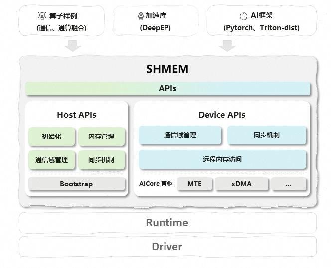
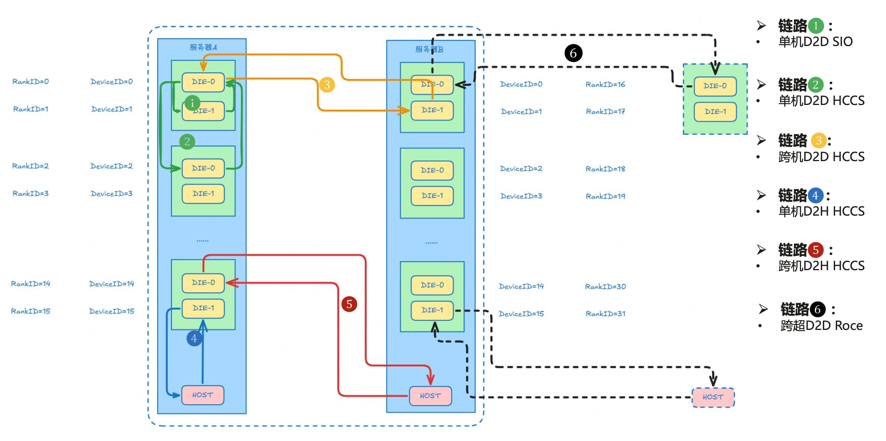

# <div align="center">SHMEM</div>

<h4><div align="center">基于对称内存的昇腾分布式内存通信加速库</div></h4>

<div align="center">

[](https://shmem-doc.pages.dev/)[](https://gitcode.com/cann/shmem/releases/v1.3.0)[](https://www.hiascend.com/)[](https://gitcode.com/cann/community/tree/master/CANN/sigs/shmem)

</div>

## 最新动态

🚀 [2026/04] [SHMEM v1.3.0](https://gitcode.com/cann/shmem/releases/v1.3.0) 版本发布，欢迎下载体验。

   - 新增 AICore 直驱能力： A2/A3 SDMA 访存和预取，950 MTE 访存，覆盖更多通信引擎。
   - 新增 40+ 接口，覆盖 RMA、Signal、P2P 同步、Barrier 等，完善通信编程语义。
   - 增强 log、sanitizer、profiling、debug 等 DFX 能力，提升问题定位效率。

🔥 [2025/12] SHMEM 项目首次上线。

## ⚡️快速入门

### 安装

SHMEM 提供三种安装方式，按需选择：

**方式一：pip 安装**

```bash
pip install cann-shmem -i https://ascend.devcloud.huaweicloud.com/cann/pypi/simple/
shmem-config --version   # 查询安装版本
shmem-config --diagnose  # 检查 native 加载和包完整性
```

> 注意：
> - 运行环境 glibc 版本需 ≥ 2.34，否则可能因缺少符号导致 `libshmem.so` 加载失败。可通过 `ldd --version` 查看本地 glibc 版本。

**方式二：二进制包安装**

```bash
# 获取软件包 SHMEM_{version}_linux-{arch}.run（见 release 页面或本地构建）
chmod +x 软件包名.run
./软件包名.run --install
source /usr/local/Ascend/shmem/latest/set_env.sh
```

**方式三：源码编译**

```bash
git clone https://gitcode.com/cann/shmem.git
cd shmem
bash scripts/build.sh             # A2/A3 平台
# bash scripts/build.sh -soc_type Ascend950  # 950 平台
source install/set_env.sh
```

> 完整安装步骤（含 CANN 环境准备、依赖说明、Docker 容器、编译执行和本地验证等）详见 [快速入门文档](docs/quickstart.md)。

安装 Python wheel 后，可通过 [shmem-config 命令参考](docs/tools/shmem_config_guide.md)查询后端和安装路径，执行环境检查及问题诊断。

若您需要了解文档和接口中出现的缩写与名词，请参考[术语表](docs/glossary.md)。

## 一、项目简介

SHMEM 是面向昇腾平台的多机多卡内存通信库，通过封装 Host 侧与 Device 侧接口，实现跨设备的高效内存访问与数据同步。其核心价值在于：

- 支持 AICore 直驱 MTE、xDMA 使能 D2D/D2H/H2D/D2rH/rH2D 通信
- 简化分布式场景下的卡间通信逻辑，降低算子开发门槛
- 与 CANN 生态深度适配，支持通算融合类算子的快速部署
- 更多详细资料请参考[SHMEM](https://shmem-doc.pages.dev/)

## 二、核心功能



**1. 双侧接口体系**

- Host 侧：负责初始化、内存堆管理、通信域（Team）创建及全局同步
- Device 侧：提供远程内存访问（RMA）、设备级同步及通信域操作

接口设计贴合昇腾算子开发范式，支持 Host 与 Device 协同工作流。

**2. 高性能通信优化**

- 内置 MTE、xDMA 引擎支持，实现远程内存直接读写，减少数据传输延迟
- 兼容 MPI 通信框架，支持集合通信（Allgather/Allreduce 等）场景
- 针对昇腾硬件特性优化数据传输路径，提升多卡协同效率

**3. 安全通信机制**

- 默认启用 TLS 加密保护跨设备数据传输，支持接口级关闭控制：

   ```c
   int32_t ret = aclshmemx_set_conf_store_tls(false, NULL, 0);
   ```

- 提供安全加固指南，包括权限配置、加密套件选择等企业级安全策略

**4. 通信通路覆盖**

下图展示了 SHMEM 支持的全链路通信通路（以910A3为例），覆盖 Host 侧与 Device 侧的不同传输引擎：



如图所示，SHMEM 支持多种通信引擎和通路：

- **MTE Engine**：芯片级内存传输引擎，支持 D2D、D2H、H2D、D2rH、rH2D 多种通路
- **xDMA Engine**：高速直接内存访问引擎，支撑主机内/主机间高效数据传输

**5. 多语言与扩展支持**

- 提供 C++ 原生接口与 Python 封装，满足不同开发场景需求
- 模块化设计支持通信后端（MTE/xDMA）动态切换，便于功能扩展

**6. 丰富场景样例**
覆盖基础通信到复杂算子融合场景：

- rdma_demo：RDMA 协议通信演示
- [CATCCOS](https://gitcode.com/cann/catccos)：通算融合算子库，包含矩阵乘法、ReduceScatter 等常用算子

## 三、代码结构

```text
shmem/                                  # 项目根目录
├── docs/                               # 文档与说明
├── examples/                           # 示例工程集合
├── include/                            # 对外头文件
│   ├── shmem.h                         # SHMEM 所有对外 API 汇总
│   ├── device/                         # Device 侧头文件
│   │   ├── gm2gm/                      # AICore 驱动 gm2gm 数据面接口
│   │   │   └── engine/                 # AICore 直驱 gm2gm 低阶接口
│   │   ├── team/                       # Device 侧通信域管理
│   │   └── ub2gm/                      # AICore 驱动 ub2gm 数据面接口
│   │       └── engine/                 # AICore 直驱 ub2gm 低阶接口
│   ├── host/                           # Host 侧头文件
│   │   ├── data_plane/                 # Host 侧数据面接口
│   │   ├── init/                       # Host 侧初始化接口
│   │   ├── mem/                        # Host 侧内存管理接口
│   │   ├── team/                       # Host 侧通信域管理接口
│   │   └── utils/                      # 工具与通用辅助代码
│   └── host_device/                    # 共用目录
├── scripts/                            # 示例脚本（编译/运行）
├── src/                                # 源码实现
│   ├── device/                         # Device 侧实现
│   │   ├── gm2gm/                      # AICore 直驱 gm2gm 数据面接口
│   │   │   └── engine/                 # AICore 直驱 gm2gm 低阶接口
│   │   ├── team/                       # Device 侧通信域管理
│   │   └── ub2gm/                      # AICore 驱动 ub2gm 数据面接口
│   │       └── mte/                    # AICore 直驱 ub2gm 低阶接口
│   ├── host/                           # Host 侧实现
│   │   ├── bootstrap/                  # bootstrap
│   │   ├── hybm/                       # Hybrid Memory 实现
│   │   ├── init/                       # 初始化
│   │   ├── mem/                        # 内存管理相关
│   │   ├── python_wrapper/             # Python 封装/绑定
│   │   ├── sync/                       # 同步原语（barrier/p2p/order）
│   │   ├── team/                       # team（通信域）相关
│   │   ├── transport/                  # 传输层实现（如 RDMA\SDMA\UDMA）
│   │   └── utils/                      # 工具与通用辅助代码
│   ├── host_device/                    # 共用目录
│   └── python/                         # Python 相关目录
└── tests/                              # 测试用例集合（UT/功能测试）
```

## 四、典型使用场景

**1. 通算融合类算子开发**：基于 Device 侧内存直接访问接口，开发融合「计算+通信」的自定义算子（如 matmul+allreduce），减少卡间数据拷贝，提升算子执行效率。

**2. 多机多卡数据同步**：通过 Host 侧通信域管理接口，快速搭建多机多卡集群的内存共享通道，实现跨节点数据同步，适配分布式训练场景。

**3. 低延迟卡间通信**：利用 RDMA 优化的 Device 侧接口，实现卡间毫秒级数据传输，满足实时性要求高的 AI 推理场景。

**4. Python 分布式训练适配**：通过 Python 扩展接口，将 SHMEM 集成到 PyTorch 分布式训练流程中，替代传统 MPI 通信，降低训练通信开销。

## 五、常见问题（FAQ）

**Q1：编译时报「CANN 环境未找到」？**

A：确认已安装 CANN toolkit，并已执行 `source /usr/local/Ascend/ascend-toolkit/set_env.sh`。项目编译默认使用 CANN toolkit 提供的 `bisheng` 编译器，CANN 版本需满足 [CANN 版本说明](docs/quickstart.md#43-cann)。

**Q2：运行示例时报「卡间通信超时」？**

A：检查 RDMA 网卡是否可用、节点间网络是否连通、防火墙是否放行初始化通信端口（默认 8666）、交换机无损网络配置是否正确，以及各节点时钟是否同步。RDMA 建链监听端口由系统自动分配，无需手工配置，RDMA 端口使用规则见 [Troubleshooting - RDMA 端口分配规则](docs/debug/Troubleshooting_FAQs.md#RDMA-端口管理规则)。

**Q3：Python 导入 shmem 时报「找不到模块」？**

A：确认已安装 wheel 包，且 `source` 了 install 目录下的 `set_env.sh`，环境变量 `PYTHONPATH` 包含 shmem 路径。

**Q4：关闭 TLS 后仍提示加密失败？**

A：需在 `aclshmemx_init_attr` 前调用 `aclshmemx_set_conf_store_tls`，初始化后无法修改 TLS 配置。

**Q5：googletest、nlohmann/json 这些依赖执行 `build.sh` 时提示 git 失败？**

A：确认 git 配置是否可以访问 GitCode。`googletest v1.14.x` 用于 UT 构建，`nlohmann/json v3.11.3` 用于 Ascend950 平台构建，默认由 `scripts/build.sh` 自动拉取；离线环境可提前准备到 `3rdparty/googletest` 和 `3rdparty/json`。详情见 [第三方源码依赖](docs/quickstart.md#47-第三方源码依赖).

**Q6：CANN 包安装失败怎么办？**

A：查看[常见问题](https://www.hiascend.com/document/detail/zh/AscendFAQ/CommuFunc/resdl/rdl_011.html)

**Q7：仓库根目录没有 Dockerfile，如何准备容器环境？**

A：本仓当前不维护独立 Dockerfile。建议根据芯片、系统架构和 CANN 版本从[昇腾镜像仓库](https://www.hiascend.com/developer/ascendhub)选择 CANN 容器镜像，再按 [Docker 容器环境](docs/quickstart.md#49-docker-容器环境) 和快速开始步骤完成源码构建。

**Q8：无 NPU 环境能否运行 UT 和 examples？**

A：可以做依赖检查和编译验证，但 `scripts/run.sh`、`scripts/run_examples.sh` 需要可用 NPU、驱动和 CANN 运行时，运行结果需在硬件环境或项目 CI 中验证。

> 更多故障排查见：[Troubleshooting](docs/debug/Troubleshooting_FAQs.md)

## 六、贡献

### 贡献者列表

- [华南理工大学 陆璐教授团队](https://www2.scut.edu.cn/cs/2017/0629/c22284a328108/page.htm)

### 参与贡献指南

欢迎订阅 [SHMEM SIG 会议](https://mailweb.cann.osinfra.cn/mailman3/lists/shmem.cann.osinfra.cn/)，参与社区例会和议题讨论，与社区成员共同交流方案设计、接口规划和使用问题。

**1. 提 Issue**

- 提交 bug：明确环境（硬件/软件版本）、复现步骤、错误日志；
- 提功能需求：说明场景、预期效果、适配的硬件/软件版本。

**2. 提 PR**

- 分支规范：功能开发用 `feature/xxx`，bug 修复用 `bugfix/xxx`；
- 代码规范：遵循项目代码规范，新增代码需补充单元测试；
- PR 描述：说明修改目的、核心逻辑、测试验证结果。

**3. 代码审核**

- PR 需通过 CI 自动测试（编译、单元测试、代码规范检查）；
- 至少 1 名维护者审核通过后，方可合并。

详细步骤可参考[贡献指南](CONTRIBUTING.md)

## 七、安全声明

- 通信安全：默认启用 TLS 加密，支持自定义加密套件
- 公网依赖：依赖的开源仓库与工具地址参见[公网地址清单](SECURITY.md#公网地址声明)
- 加固指南：参考[安全加固建议](SECURITY.md#安全加固)配置系统权限与防火墙

## 八、版权与许可

Copyright (c) 2025 Huawei Technologies Co., Ltd.
本项目基于 CANN Open Software License Agreement Version 2.0 授权，仅允许用于昇腾处理器相关开发。

## 九、注意事项

1. 本项目仅适配昇腾平台，不支持其他硬件架构（如 x86 通用服务器、NVIDIA GPU）；
2. 示例代码仅供学习参考，生产环境使用前需完成充分的功能和性能测试；
3. CANN 版本升级可能导致接口兼容问题，建议锁定文档指定的 CANN 版本；
4. 关闭 TLS 加密后，需确保通信网络为可信内网，避免数据泄露风险。
