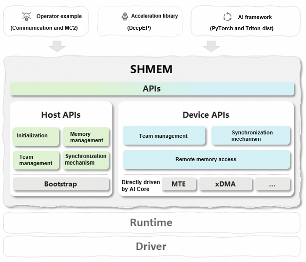
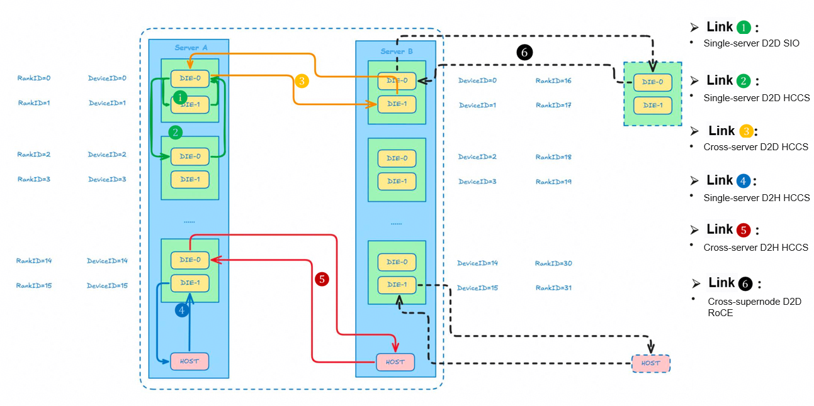

<div align="center">

# SHMEM

<h4>Symmetric Memory-based Ascend Distributed Memory Communication Acceleration Library</h4>

[](https://shmem-doc.pages.dev/)
[](https://gitcode.com/cann/shmem/releases/v1.3.0)
[](https://www.hiascend.com/)
[](https://gitcode.com/cann/community/tree/master/CANN/sigs/shmem)

</div>

## What's New
🚀 [April 2026] [SHMEM v1.3.0 release](https://gitcode.com/cann/shmem/releases/v1.3.0). Download and experience it now.
   - Introduced AI Core direct-driven capabilities: 910B/910C SDMA memory access and prefetch, 950 MTE memory access, and more communication engines.
   - Added 40+ new APIs, spanning RMA, signaling, P2P synchronization, and barrier operations, enriching communication semantics.
   - Enhanced DFX capabilities, such as logging, sanitizers, profiling, and debugging, for faster problem pinpointing.

🔥 [December 2025] Initial launch of the SHMEM project

## 1. Project Introduction
SHMEM is a multi-server, multi-device memory communication library designed for the Ascend platform. By abstracting host APIs and device APIs, SHMEM enables fast cross-device memory access and data synchronization. Its core benefits include:
- Support for AI Core direct-driven MTE/xDMA, enabling D2D, D2H, H2D, D2rH, and rH2D communication paths
- Simplified inter-device communication logic in distributed workloads, lowering operator development complexity
- Deep integration with the CANN ecosystem, accelerating deployment of MC2 operators
- For more information, see [SHMEM](https://shmem-doc.pages.dev/).


## 2. Core Functions


**Dual-side APIs**
- Host APIs: initialization, memory heap management, communicator (often called team) creation, and global synchronization
- Device APIs: remote memory access (RMA), device-level synchronization, and team operations

The API design follows the Ascend operator development rules and supports host-device collaboration.

**High-performance communication optimization**
- Built-in MTE and xDMA engines for direct remote memory read/write, minimizing latency
- MPI interoperability, supporting collective communication primitives such as AllGather and AllReduce
- Optimized data transfer paths for Ascend hardware features to improve the multi-device collaboration efficiency

**Secure communication mechanism**
- TLS encryption is enabled by default to protect cross-device data transfer and can be disabled for specific APIs:
   ```c
   int32_t ret = aclshmemx_set_conf_store_tls(false, NULL, 0);
   ```

- Enterprise-grade security guidelines are provided, covering permission configurations and cipher suite selection.

**Comprehensive communication channels**

The following figure shows the full-link communication channels supported by SHMEM (using Ascend 910A3 as an example), covering different transmission engines on the host and device.



As shown in the figure, SHMEM supports diverse communication engines and channels:
- **MTE engine**: chip-level memory transfer, supporting D2D, D2H, H2D, D2rH, and rH2D
- **xDMA Engine**: high-speed direct memory access (DMA), supporting intra-host and inter-host fast data transfer

**Multi-language and extensibility**
- Native C++ APIs and Python bindings
- Modular backend design enabling dynamic switching between MTE and xDMA

**Extensive use cases**
Use cases from basic communication to complex operator fusion:
- rdma_demo: RDMA communication demonstration
- matmul_allreduce: implementation of MC2 operators (matrix multiplication + AllReduce)


## 3. Environment Setup

### 3.1 Hardware Requirements
- Atlas series: 800I A2/A3 and 800T A2/A3
- Architecture compatibility: AArch64 and x86

### 3.2 Software Dependencies
#### 3.2.1 CANN Version Description
| Driver/Firmware| CANN Version| D2D | D2H/H2D | D2rH/rH2D | Other Dependencies|
| --- | --- | --- | --- | --- | --- |
| Ascend HDK 25.0.RC1.1 | 9.0.0-beta.2 or later<br>[Community Edition Resources](https://www.hiascend.com/developer/download/community/result?module=cann)| MTE<br>RDMA<br>SDMA | MTE | MTE | To enable SDMA, download the community edition of [ops-legacy package](https://www.hiascend.com/developer/download/community/result?module=cann).|
| Ascend HDK 25.0.RC1.1 | 9.0.0 or later<br>Toolkit package for the trial version: [x86_64](https://ascend.devcloud.huaweicloud.com/artifactory/cann-run-mirror/software/legacy/20260305000326487/x86_64/Ascend-cann-toolkit_9.0.0_linux-x86_64.run) / [aarch64](https://ascend.devcloud.huaweicloud.com/artifactory/cann-run-mirror/software/legacy/20260305000326487/aarch64/Ascend-cann-toolkit_9.0.0_linux-aarch64.run)| MTE<br>RDMA<br>SDMA | MTE | MTE | To enable SDMA, download the ops-legacy package (based on the hardware platform): [A2 x86_64](https://ascend-cann.obs.cn-north-4.myhuaweicloud.com/CANN/20260305_newest/cann-910b-ops-legacy_9.0.0_linux-x86_64.run) / [A2 aarch64](https://ascend-cann.obs.cn-north-4.myhuaweicloud.com/CANN/20260305_newest/cann-910b-ops-legacy_9.0.0_linux-aarch64.run) / [A3 x86_64](https://ascend-cann.obs.cn-north-4.myhuaweicloud.com/CANN/20260305_newest/cann-A3-ops-legacy_9.0.0_linux-x86_64.run) / [A3 aarch64](https://ascend-cann.obs.cn-north-4.myhuaweicloud.com/CANN/20260305_newest/cann-A3-ops-legacy_9.0.0_linux-aarch64.run)|
| Ascend HDK 25.0.RC1.1 | 8.5.0 or later<br>[Community Edition Resources](https://www.hiascend.com/developer/download/community/result?module=cann)| MTE<br>RDMA | MTE | MTE | Enabling A3 D2rH/rH2D: LingQu Computing Network [1.5.0](https://support.huawei.com/enterprise/en/ascend-computing/lingqu-computing-network-pid-258003841/software)<br>Upgrade guide: [Installation Guide](https://support.huawei.com/enterprise/en/ascend-computing/lingqu-computing-network-pid-258003841)|
| Ascend HDK 25.0.RC1.1 | 8.3.RC1 or later<br>[Community Edition Resources](https://www.hiascend.com/developer/download/community/result?module=cann)| MTE<br>RDMA |  |  | |

#### 3.2.2 CANN Package Installation
See [CANN Quick Installation](https://www.hiascend.com/document/detail/en/CANNCommunityEdition/850alpha002/softwareinst/instg/instg_quick.html?Mode=PmIns&OS=openEuler&Software=cannToolKit).

Configure CANN environment variables (using a default installation path):
```bash
source /usr/local/Ascend/ascend-toolkit/set_env.sh
```

Configure CANN environment variables (using a custom installation path):
```bash
source ${install_path}/ascend-toolkit/set_env.sh
```

### 3.3 Other Software Dependencies
- Install the PyTorch framework and torch_npu plugin.
  - The package must be installed to build and run PyTorch operators with input and output tensors.
  - Select the version to be installed based on the actual environment. For details, see [Ascend Extension for PyTorch](https://www.hiascend.com/document/detail/en/Pytorch/720/configandinstg/instg/insg_0004.html).
- Toolchains:
  - CMake 3.19 or later
  - GLIBC 2.28 or later

### 3.4 Python Dependency Installation
```bash
# Hard dependencies (required for build + runtime)
python3 -m pip install -r requirements.txt

# Additional dependencies (optional) for running Python examples
python3 -m pip install -r requirements-examples.txt
```

### 3.5 Optional Dependencies
- MPI: Open MPI 4.0+ (distributed communication)
- Python: 3.7+ (used for Python APIs)
- PyTorch: 1.12+ (used for running Python samples)

## 4. Quick Start

### 4.1 Installation Methods
#### 4.1.1 Method 1: Source Code Build
```bash
# Clone the code repository.
git clone https://gitcode.com/cann/shmem.git
cd shmem

# Build the core library (excluding the xDMA capability, examples, and tests by default).
bash scripts/build.sh

# Configure environment variables.
source install/set_env.sh
```
Note: For details about the parameters of build.sh, see [compilation_build_guide_en.md](./docs/compilation_build_guide_en.md).

#### 4.1.2 Method 2: Binary Package Installation
How to obtain: `bash scripts/build.sh -package`

Software package format: `SHMEM_{version}_linux-{arch}.run`
```bash
# Go to the corresponding directory.
cd {project_root}/package/{arch}/
# Configure and verify permissions.
chmod +x SHMEM_{version}_linux-{arch}.run
./SHMEM_{version}_linux-{arch}.run --check

# Install the package (default path: /usr/local/Ascend/shmem).
./SHMEM_{version}_linux-{arch}.run --install

# Configure environment variables.
# (Default path: /usr/local/Ascend/shmem)
source /usr/local/Ascend/shmem/latest/set_env.sh
# (Custom path: ${install_path}/shmem)
source ${install_path}/shmem/latest/set_env.sh
```

### 4.2 Installation Verification
Use `matmul_allreduce` as an example to verify core functions.

1. Build in the `shmem/` source directory:

   ```sh
   bash scripts/build.sh -examples
   ```

2. Run the demo in the `shmem/examples/matmul_allreduce` directory:

   ```sh
   bash scripts/run.sh -ranks 2 -M 1024 -K 2048 -N 8192
   ```

Note: The examples and other sample code are for reference only. Exercise caution when using them in the production environment.

### 4.3 Debug Mode
Build in the `shmem/` source directory:

   ```sh
   bash scripts/build.sh -examples -debug
   ```

Note: The `-examples` parameter is optional. For details, see [Usage Reference](./docs/debug/Troubleshooting_FAQs_en.md#shmem-faqs).

### 4.4 Python APIs
Note: For details about the Python API list, see [Python API List](./docs/api/pythonAPI_en.md).

1. Build the Python extension in the root directory of the repository:

   ```sh
   bash scripts/build.sh -python_extension
   ```

2. Source the environment setup script in the installation directory to configure environment variables:

   ```sh
   source install/set_env.sh
   ```

3. Set whether to enable TLS authentication. By default, TLS authentication is enabled. To disable TLS authentication, use the following API:

   ```python
   import shmem as shm
   shm.set_conf_store_tls(False, "")   # Disable TLS authentication
   ```

   ```python
   import shmem as shm
   tls_info = "xxx"
   shm.set_conf_store_tls(True, tls_info) # Enable TLS authentication
   ```

4. Run the Python extension test demo.

   ```sh
   bash examples/python_extension/run.sh
   ```

If `test.py running success!` is printed in the log, the demo is running.


## 5. Code Structure
```
shmem/                                 # Project root directory
├── docs/                              # Documentation and description
├── examples/                          # A collection of examples
├── include/                           # External header files
│   ├── shmem.h                        # All SHMEM external APIs
│   ├── device/                        # Device-side header file
│   │   ├── gm2gm/                     # Data plane API gm2gm driven by AI Core
│   │   │   └── engine/                # Low-level API of gm2mm, directly driven by AI Core
│   │   ├── team/                       # Device-side team management
│   │   └── ub2gm/                     # Data plane API ub2gm driven by AI Core
│   │       └── engine/                 # Low-level API of ub2gm, directly driven by AI Core
│   ├── host/                          # Host-side header file
│   │   ├── data_plane/                # Host-side data plane API
│   │   ├── init/                      # Host-side initialization API
│   │   ├── mem/                       # Host-side memory management API
│   │   ├── team/                      # Host-side team management API
│   │   └── utils/                     # Tools and general auxiliary code
│   └── host_device/                   # Shared directory
├── scripts/                           # Sample scripts (build/run)
├── src/                               # Source code implementation
│   ├── device/                        # Device-side implementation
│   │   ├── gm2gm/                     # Data plane API gm2gm directly driven by AI Core
│   │   │   └── engine/                # Low-level API of gm2mm, directly driven by AI Core
│   │   ├── team/                       # Device-side team management
│   │   └── ub2gm/                     # Data plane API ub2gm driven by AI Core
│   │       └── mte/                    # Low-level API of ub2gm, directly driven by AI Core
│   ├── host/                          # Host-side implementation
│   │   ├── bootstrap/                  # bootstrap
│   │   ├── hybm/                      # Hybrid Memory implementation
│   │   ├── init/                      # Initialization
│   │   ├── mem/                       # Memory management
│   │   ├── python_wrapper/            # Python encapsulation/bindings
│   │   ├── sync/                      # Synchronization primitives (barrier/p2p/order)
│   │   ├── team/                       # Team (communicator)
│   │   ├── transport/                  # Transport layer implementation (such as RDMA, SDMA, and UDMA)
│   │   └── utils/                     # Tools and general auxiliary code
│   ├── host_device/                   # Shared directory
│   └── python/                         # Python-related directory
└── tests/                              # Test case set (UTs/functional tests)
```

## 6. Typical Use Cases
**MC2 operator development**: Develop custom operators (Matmul + AllReduce) that merge compute and communication by leveraging device-side direct memory access APIs. This reduces inter-device data copies and improves operator execution efficiency.

**Multi-server, multi-device data synchronization**: Use host-side team management APIs to quickly establish shared memory channels for a multi-server, multi-device cluster, enabling efficient data synchronization across servers for distributed training workloads.

**Low-latency inter-device communication**: Employ RDMA-optimized device-side APIs to transfer data among devices in milliseconds, meeting the real-time requirements of latency-sensitive AI inference scenarios.

**Python distributed training adaptation**: Integrate SHMEM into PyTorch distributed workflows via Python extension APIs, replacing traditional MPI communication to reduce training communication overhead.

## 7. Test Framework
- **Unit tests**: designed for core APIs (such as initialization, memory operations, and synchronization), located in `tests/unittest/`.

- **Operator generalization tests**: dynamic generation of test data and accuracy checks for examples such as `matmul_allreduce`.

### 7.1 Running Unit Tests

```bash
# Build and run unit tests.
bash scripts/build.sh -uttests
bash scripts/run.sh
```
The run.sh script provides parameters, such as `-ranks` and `-test_filter`, to customize the number of devices used and to apply `gtest_filter` for executing tests. Example:
```bash
# Run all *Init* test cases on 8 devices.
bash scripts/run.sh -ranks 8 -test_filter Init
```
For details about the parameters, see [Related Scripts-run.sh](docs/compilation_build_guide_en.md#Key-SHMEM-Files).

### 7.2 Building and Running Examples

```bash
bash scripts/build.sh -examples
bash scripts/run_examples.sh
```

### 7.3 Running an Example Independently
You can view the README file in the corresponding example directory under the `examples` directory.

### 7.4 Running Python Test Cases
```bash
# Build Python extensions.
bash scripts/build.sh -python_extension
# Install a wheel package generated by the build script.
pip3 install dist/shmem-xxx.whl --force-reinstall
```

You can also manually build and install the wheel package in the root directory of the repository.

```bash
python3 setup.py bdist_wheel
pip3 install dist/shmem-xxx.whl --force-reinstall
```

```bash
# Run the Python test on two devices.
torchrun --nproc-per-node=2 examples/python_extension/test/init_test.py
```

### 7.5 Custom Tests
Based on the GTest framework in the `tests/` directory, new test cases must comply with the following rules:
- Test file naming: `{module}_test.cc`
- Test case naming: `{FunctionName}_{Scenario}_Test`

## 8. Configuration and Tuning (Optional, Advanced Usage)
**Disabling TLS encryption (to improve communication performance)**

TLS encryption is enabled by default. In a trusted intranet environment, it can be disabled to accelerate communication:
```c
int32_t ret = aclshmemx_set_conf_store_tls(false, NULL, 0);
```
```python
import shmem as shm
shm.set_conf_store_tls(False, "")
```

**Adjusting the shared memory size**

Specify the shared memory pool size during initialization (default: 16 GB) to support large-memory scenarios:
```c
aclshmemx_init_attr_t attr;
attr.local_mem_size = 32 * 1024 * 1024 * 1024; // 32GB
aclshmemx_init_attr(ACLSHMEMX_INIT_WITH_DEFAULT, &attr);
```

**Performance tuning suggestions**
- Prefer device APIs to minimize host-device interactions.
- Group teams by physical node to reduce cross-node communication.
- For large-batch data transfers, enable the RDMA protocol (by adding `-DSHMEM_RDMA=ON` during the build).

## 9. FAQs
**Question 1: What do I do If a message is displayed indicating that the CANN environment is not found during a build?**

Answer: Ensure that `source /usr/local/Ascend/ascend-toolkit/set_env.sh` has been executed and the CANN version meets the requirements in [Environment Dependencies](#32-software-dependencies).

**Question 2: What do I do if a message is displayed indicating that inter-device communication timed out during example running?**

Answer: Check whether RDMA is enabled on the NIC, whether the firewall allows the communication port (8666 by default), and whether the clocks of all nodes are synchronized.

**Question 3: What do I do if a message is displayed indicating that the module cannot be found when I import shmem to Python?**

Answer: Ensure that the wheel package has been installed, the `set_env.sh` file in the `install` directory has been sourced, and the environment variable `PYTHONPATH` contains the `shmem` path.

****Question 4: What do I do if an encryption failure message is still displayed after TLS is disabled?****

Answer: Call the `aclshmemx_set_conf_store_tls` function before `aclshmemx_init_attr`. After the initialization, the TLS configuration cannot be modified.

**Question 5: What do I do if a Git failure message is displayed when `build.sh` is executed using the GoogleTest and Catlass plugins?**

Answer: Check whether your Git configuration can access external websites. If the environment cannot connect to the websites, manually the required packages and place them under the `3rdparty` directory.

**Question 6: What can I do if the CANN package fails to be installed?**

Answer: See [FAQs](https://www.hiascend.com/document/detail/en/AscendFAQ/CommuFunc/resdl/rdl_011.html).

> For more troubleshooting information, see [Troubleshooting](docs/debug/Troubleshooting_FAQs_en.md).

## 10. Contributions
### Contributors
- [Professor Lu Lu, South China University of Technology](https://www2.scut.edu.cn/cs/2017/0629/c22284a328108/page.htm)

### Contribution
Subscribe to [SHMEM SIG Meetings](https://mailweb.cann.osinfra.cn/mailman3/lists/shmem.cann.osinfra.cn/) and join regular community meetings and discussions. Share your ideas on solution design, API planning, and usage with other members.

**1. Submitting issues**

- Submit bug reports to specify the environment (hardware/software versions), reproduction steps, and error logs.
- Submit feature requests by describing use cases, expected outcome, and supported hardware/software versions.

**2. Submitting a PR**

- Branch naming convention: Use `feature/xxx` for new features and `bugfix/xxx` for bug fixes.
- Coding standards: Follow project coding guidelines. New code must include unit tests.
- PR description: Explain the purpose of the changes, core logic, and test validation results.

**3. Reviewing code**

- PRs must pass CI automated checks (builds, unit tests, code style validation).
- At least one maintainer's approval is required before merging.

For details, see [Contribution Guide](CONTRIBUTING_en.md).

## 11. Security Statement
- Communication security: TLS encryption is enabled by default, and custom cipher suites are supported.
- Public network dependencies: For details about required open-source repositories and tools, see [Public Network Address List](SECURITY_en.md#public-network-address-statement).
- Security hardening guide: Configure system permissions and firewalls by referring to [Security Hardening Suggestions](SECURITY_en.md#security-hardening).

## 12. Copyright and License
Copyright (c) 2025 Huawei Technologies Co., Ltd.
This project, licensed under CANN Open Software License Agreement Version 2.0, is exclusively for Ascend processor development.

## 13. Precautions
1. This project works only on the Ascend platform and does not support other hardware like x86 servers or NVIDIA GPUs.
2. The example code is for learning and reference. Test its functionality and performance before using it in a production environment.
3. Upgrading the CANN version can cause API compatibility issues. Use the CANN versions specified in this document.
4. After TLS encryption is disabled, ensure that the communication network is a trusted intranet to prevent data leakage.
