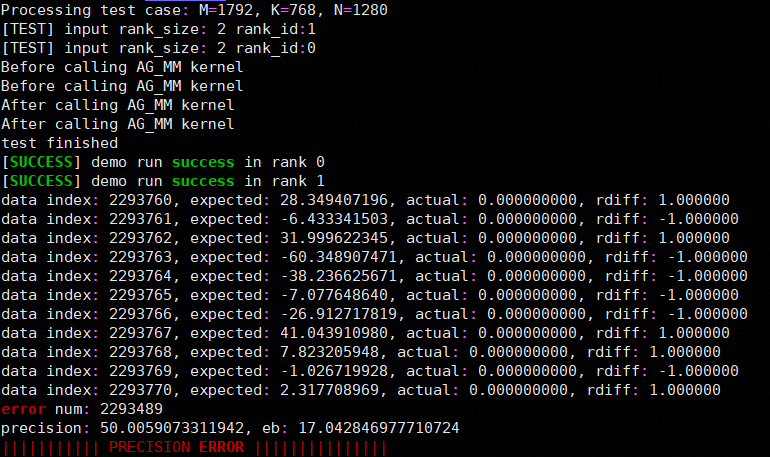
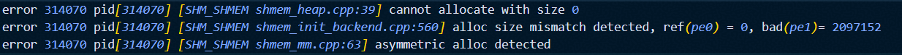
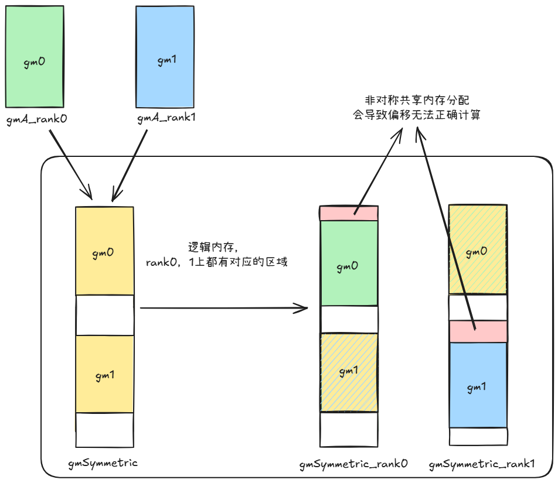
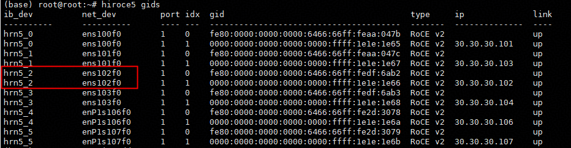
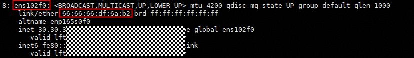
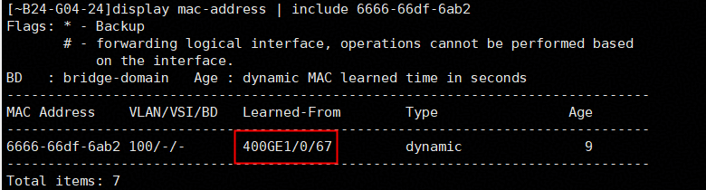

# SHMEM 使用限制

1. GM2GM的高阶 RMA 操作使用默认buffer，不支持并发操作，否则可能造成数据覆盖。若有并发需求，建议使用低阶接口。
2. barrier接口当前必须在Mix Kernel（包含mmad和GM2UB/UB2GM操作）中使用，可参考example样例。该限制待编译器更新后移除。
3. 使用RDMA的高阶接口前，需要先使用`aclshmemx_rdma_config`接口配置UB Buffer和sync_id等信息，且需要保证预留UB Buffer大小大于等于128字节。若不配置，则使用默认的190KB处的UB Buffer和EVENT_ID0作为接口内部的同步EVENT_ID。RDMA相关接口内部使用`PipeBarrier<PIPE_MTE3>`阻塞MTE3流水以确保RDMA任务下发完成。RDMA 引擎专用 Put/Get 接口的 `src`、`dst` 都必须指向对称内存，且各自的完整传输范围不得越过其所在的内存分配。通用 Put/Get 接口仍保留标准 RMA 操作数语义；但通过 `ACLSHMEM_DATA_OP_ROCE` 使能 RDMA 后，运行时可能按目标 PE 自动选择 RDMA，因此调用者必须预先保证两端都指向对称内存，无需判断单次调用实际使用的引擎。
4. 使用SDMA的高阶接口前，需要先使用`aclshmemx_sdma_config`接口配置UB Buffer和sync_id等信息，且需要保证预留UB Buffer大小大于等于64字节。若不配置，则使用默认的191KB处的UB Buffer和EVENT_ID0作为接口内部的同步EVENT_ID。
5. 使用UDMA的高阶接口前，可使用`aclshmemx_set_udma_config`接口配置UB Buffer和sync_id等信息，且需要保证预留UB Buffer大小大于等于128字节。若不配置，则使用默认的189KB处的UB Buffer和EVENT_ID0作为接口内部的同步EVENT_ID。UDMA高阶接口默认通过`PIPE_MTE3` staging下发WQE，该UB Buffer用于暂存一块完整WQE。
6. A2 16卡机型：NPU分为前八卡后八卡两个8P Fullmesh组，每个8P组内通过HCCS总线完成两两互联，两个8P Fullmesh组之间通过PCIe-SW完成互连，因此不支持直接使用MTE接口在跨组NPU间完成数据搬运。部分example用例使用MTE搬运接口，单机用例请勿跨组指定NPU，以防发生未知报错（如流同步失败等）。
7. A3 D2H/D2rH等功能，需要确保Host内存（DRAM）可用空间大于aclshmemx_init_attr_t初始化过程中pe分配的local_mem_size大小。因为HCCS总线上DRAM地址范围是固定的，部分环境上并不是所有DRAM都在HCCS固定的总线地址范围内，只有和HCCS总线固定的地址交集部分才是可用的DRAM空间。确认DRAM可用空间方法：通过lsmem查询本机物理地址范围，和如下4个地址区间取交集（0x29580000000-0x34000000000， 0xa9580000000-0xb4000000000， 0x129580000000-0x134000000000， 0x1a9580000000-0x1b4000000000），得到具体可用的DRAM容量。如果没有交集，表示当前没有可用DRAM空间或可用空间小于配置的local_mem_size，则不支持该功能。

# SHMEM 常见问题

## 内存分配相关问题

### aclshmem_malloc多卡分配非对称共享内存

#### Q: 算子精度问题，无error日志，发现共享内存访问到的数据异常



错误示例代码:

以`example`目录下的`sdma`为例，以下为非对称共享内存分配的简单示例场景：

```cpp
// Inappropriate calling of aclshmem_malloc
void *symmTest = nullptr;
symmTest = aclshmem_malloc(((rank_id + 1) * 1024 * 1024) * sizeof(__fp16));

void *symmPtr = aclshmem_malloc((204 * 1024 * 1024) * sizeof(__fp16));
uint8_t *gmSymmetric = (uint8_t *)symmPtr;

... ...

aclshmem_free(symmPtr);
if (symmTest != nullptr) {
    aclshmem_free(symmTest);
}
```

#### A: 可使用debug模式排查共享内存分配对称性问题

`debug`模式开启方法：在代码仓根目录下执行：

- A2/A3 平台：`bash scripts/build.sh -examples -debug`
- Ascend950 平台：`bash scripts/build.sh -soc_type Ascend950 -examples -debug`

此时执行代码获得如下报错，确认错误为使用`aclshmem_malloc`接口分配了非对称的共享内存



错误原因分析示意图:

修正方式: 确保每个rank分配相同大小的共享内存



### aclshmemx_set_attr_uniqueid_args对每个pe设置了不同的local_mem_size

#### Q: 提示local size diffs

错误调用代码片段:

```cpp
aclshmemx_init_attr_t attributes;
aclshmemx_uniqueid_t uid = ACLSHMEM_UNIQUEID_INITIALIZER;

int64_t local_mem_size = (1024 + pe * 2) * 1024 * 1024;
if (pe == 0) {
    status = aclshmemx_get_uniqueid(&uid);
}

MPI_Bcast(&uid, sizeof(aclshmemx_uniqueid_t), MPI_UINT8_T, 0, MPI_COMM_WORLD);
status = aclshmemx_set_attr_uniqueid_args(pe, pe_size, local_mem_size, &uid, &attributes);
status = aclshmemx_init_attr(ACLSHMEMX_INIT_WITH_UNIQUEID, &attributes);
```

错误日志:


注意:

1. 日志中显示的实际分配大小和local_mem_size大小有`6MB`的差异为shmem框架内部使用空间
2. 此处`local_mem_size`大小为`2MB`对齐，若尝试分配其他大小如`1025 * 1024 * 1024`可能会出现不同的错误信息:

    

#### A: 应保证aclshmemx_init_attr_t初始化过程中每pe分配的local_mem_size大小一致

## IP/PORT配置相关问题

### 绑定端口被占用

#### Q: 尝试使用的ip/port已被占用，错误日志如图

1. 端口被占用错误日志:

    

2. ip不可用错误日志1:

    

3. ip不可用错误日志2:

    

#### A: 逐步排查ip及端口可用情况

1. 确认ip是否符合预期
2. 检查端口是否被占用，`netstat -tuln | grep <端口号>`
3. 调整环境变量`SHMEM_UID_SESSION_ID`及实际执行文件所使用的ip及端口号

### default 模式同一端口多次初始化失败

#### Q: 使用 default 模式（`ACLSHMEMX_INIT_WITH_DEFAULT`）时，对同一端口进行多次初始化（例如在同一进程中创建多个实例，或重复调用初始化接口而未更换端口），出现端口已被占用的错误

错误日志特征：

- `address in use for bind listen on ...` 或 `ACC_LINK_ADDRESS_IN_USE`
- `startup acc tcp server on port: ... already in use.`
- `bind failed` / `bind socket fail`

#### A: default 模式下每次初始化都会绑定一个独立端口。若端口已被前一个实例占用（未 finalize），则再次初始化会因端口冲突而失败。解决方案

1. **多实例场景**：设置 `SHMEM_INSTANCE_PORT_RANGE=start:end`，并将 `ip_port` 中的端口设为 `0`（如 `tcp://127.0.0.1:0`），框架会根据 `instance_id` 自动分配 `start_port + instance_id` 作为实际端口，保证各实例使用不同的端口。
2. **单实例多次初始化场景**：确保每次初始化时使用不同的可用端口，或确保上一次初始化已完成 `finalize` 释放端口后再进行下一次初始化。

### 未通过环境变量配置ip/port，且使用自动搜索可用网口时失败

#### Q: `SHMEM_UID_SESSION_ID`和`SHMEM_UID_SOCK_IFNAME`均未配置时自动搜索可用网口（IPv4/IPv6均可，排除lo/docker/veth/br-/virbr/tun/tap等虚拟接口），查询失败时错误日志如下


#### A: 应手动配置可用的`SHMEM_UID_SESSION_ID`或`SHMEM_UID_SOCK_IFNAME`

配置示例:

- SHMEM_UID_SESSION_ID:

    `SHMEM_UID_SESSION_ID=127.0.0.1:1234`

    `SHMEM_UID_SESSION_ID=localhost:8888`
- SHMEM_UID_SOCK_IFNAME:

    `SHMEM_UID_SOCK_IFNAME=[6666:6666:6666:6666:6666:6666:6666:6666]:886`

    `SHMEM_UID_SOCK_IFNAME=enpxxxx:inet4` 取ipv4

    `SHMEM_UID_SOCK_IFNAME=enpxxxx:inet6` 取ipv6

    `SHMEM_UID_SOCK_IFNAME=eth0` 自动探测可用协议（优先ipv4）

注意: 同时配置时只读取`SHMEM_UID_SESSION_ID`

## RDMA相关问题

### 同端口通信需开启端口桥

#### Q: 1825 网卡单机多 NPU 共用同一物理端口，RDMA 通信失败

#### A: 1825 网卡在单机多 NPU 场景下，若多个 NPU 共用同一物理端口，两个 NPU 间的 RDMA 流量会从该端口发出、经交换机后从同一端口返回。交换机默认丢弃此类**同源同宿报文**，导致通信失败。需在交换机对应接口开启**端口桥**（port bridge）功能

> 详细说明：[配置端口桥功能](https://support.huawei.com/hedex/hdx.do?docid=EDOC1100558302&id=ZH-CN_TASK_0000001176744393)

**操作步骤：**

1. 确认 NPU 所连交换机端口，首先需要了解物理连线，明确网卡各端口与 NPU 卡的对应关系（即哪些 NPU 共用同一网卡端口）。

   **常用排布参考（8卡机型）：**

   | NPU 卡 | 网卡设备 |
   |--------|----------|
   | 0、1   | hrn5_1   |
   | 2、3   | hrn5_0   |
   | 4、5   | hrn5_3   |
   | 6、7   | hrn5_2   |

   例如，若需要 NPU 6 和 NPU 7 之间通信，二者共用 `hrn5_2` 端口，需在交换机对应的 `hrn5_2` 端口上开启端口桥。

   - 通过 `ibv_devinfo` 或 `hiroce5 gids` 查看网络设备（`net_dev` 列）：

     ```bash
     ibv_devinfo
     # 或
     hiroce5 gids
     ```

     

   - 通过 `ifconfig <net_dev>` 或 `ip link show <net_dev>` 查看对应接口的 MAC 地址：

     ```bash
     ifconfig <net_dev>
     # 或
     ip link show <net_dev>
     ```

     

   - 根据该 MAC 地址，在交换机上查询对应端口号：

     ```bash
     display mac-address | include <mac-address>
     ```

     

   > 注：上述命令中的 `<net_dev>` 需替换为上一步查询到的实际网络设备名（如 `enp3s0`），`<mac-address>` 需替换为上一步查询到的实际 MAC 地址（格式如 `aabb-ccdd-eeff`）。
   >
   > 注：若需查询 NPU 6、7（共用 `hrn5_2`，需端口桥）或 NPU 5、6（跨 `hrn5_3` 与 `hrn5_2`，无需端口桥）对应的交换机端口，需先在这两组 NPU 之间各进行一次 RDMA 通信（例如运行 `rdma_demo`），使交换机学到对应的 MAC 表项，否则 `display mac-address` 可能查不到对应记录。

2. 登录交换机，进入系统视图：`system-view`
3. 进入对应接口（以 100GE1/0/1 为例，按实际替换）：

   ```bash
   interface 100GE1/0/1
   ```

4. 开启端口桥：

   ```bash
   port bridge enable
   ```

5. 提交：`commit`
6. 验证：`display current-configuration | include port bridge`，输出含 `port bridge enable` 即成功。
7. 多个接口需同端口通信时，对每个接口重复 3-5。

配置完成后，在使用相同网卡端口的 NPU 卡上运行 `rdma_demo` 即可验证通信是否正常。

### 通信丢包

#### Q: 使能RDMA(RoCEv2)后，网络出现丢包现象

#### A: 检查交换机和端侧的TC与SL配置是否正确，如果不一致会出现丢包现象。可以参考[环境变量说明](../api/env_vars_intro.md)对环境变量[HCCL_RDMA_TC](https://www.hiascend.com/document/detail/zh/canncommercial/900/maintenref/envvar/envref_07_0089.html)和[HCCL_RDMA_SL](https://www.hiascend.com/document/detail/zh/canncommercial/900/maintenref/envvar/envref_07_0090.html)进行设置

### RDMA 端口管理规则

Ascend950 RDMA V2 建链监听端口由系统自动分配，用户无需配置 RDMA 建链端口。

- 同一 RDMA IP 上启动多个进程或多个 SHMEM instance 时，无需为每个进程手工分配 RDMA 建链端口。
- RDMA 建链端口与初始化通信端口不同；初始化通信端口仍按初始化方式配置，例如 default 模式下的实例端口或 unique id 模式下的 `SHMEM_UID_SESSION_ID`。
- 若建链失败，请优先检查 RDMA 网卡连通性、GID index、交换机 PFC/ECN 等网络配置。

### 建链失败检查

#### Q: RDMA 建链报错 `HcommChannelCreate failed: 19`（HCCL_E_NETWORK）

#### A: 该错误通常为 RDMA QP 状态迁移（INIT→RTR）超时，与端口分配无关。请依次检查

1. 确认 GID index 两端一致：日志中 `gid_idx` 字段
2. 确认 RDMA 网卡间 IP 层可达：`ping <对端RDMA_IP>`
3. 检查交换机 PFC/ECN 无损网络配置

### 卡间同步Device侧执行卡死

#### Q: 在算子代码中调用RDMA卡间同步接口 `aclshmemx_roce_sync_all, aclshmemx_roce_barrier_all, aclshmemx_roce_barrier, aclshmemx_roce_team_sync`出现某几个PE执行卡死

#### A: 确保当前调用上述接口的算子只在AIV上执行

## 调试相关

### 编译问题

#### Q:自行添加"-O0 -g"编译选项调试，编译出错，"bisheng: error: xxxxx will be ignored. [-Werror -Woption-ignored]"

#### A:SHMEM根目录的CMakeLists.txt的-Werror选项导致编译器告警被作为错误处理，注释掉-Werror编译选项即可解决

### 算子问题

#### Q:算子使用"-O0 -g"编译选项编译后，运行出错，"min stack size is xxx, larger than current process default size 32768. Please modify aclInit json, and reboot process."

#### A:在aclInit()接口传入的json文件中，配置更大的栈空间

[配置参考](https://www.hiascend.com/document/detail/zh/CANNCommunityEdition/850/devaids/optool/atlasopdev_16_0145.html)
