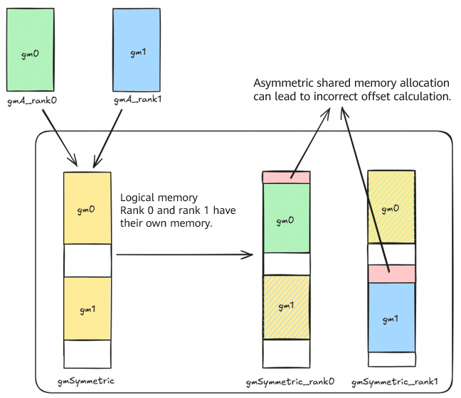
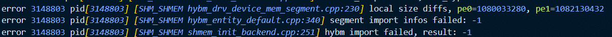
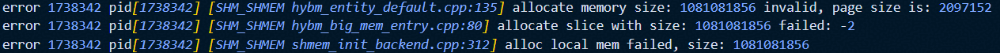
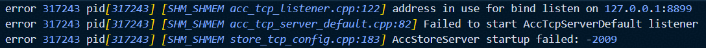
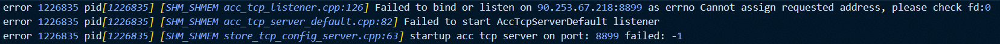
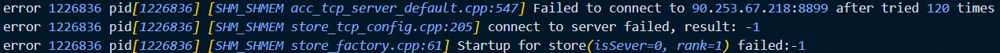
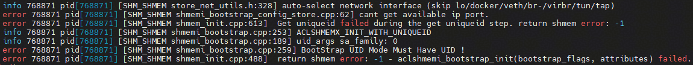

# SHMEM Usage Restrictions
1. High-level RMA operations of GM2GM use the default buffer, and concurrent operations are not supported. Otherwise, data may be overwritten. If there are concurrent operations, you are advised to use low-level APIs.
2. The barrier API must be used in the MIX kernel (including mmad and GM2UB/UB2GM operations). For details, see the example. This restriction will be removed after the compiler is updated.
3. Before using the high-level RDMA APIs, use the `aclshmemx_rdma_config` API to configure information such as the Unified Buffer and sync_id. If not configured, the default 190-KB Unified Buffer and EVENT_ID0 (as the internal synchronization EVENT_ID) are used. The RDMA APIs use `PipeBarrier<PIPE_MTE3>` to block the MTE3 pipeline to ensure that the RDMA tasks are delivered.
4. Before using high-level SDMA APIs, you need to use the `aclshmemx_sdma_config` API to configure information such as the Unified Buffer and sync_id. Ensure that the reserved Unified Buffer size is greater than or equal to 64 bytes. If not configured, the default 191-KB Unified Buffer and EVENT_ID0 (as the internal synchronization EVENT_ID) are used.
5. 910B 16-card model: There are eight NPUs in the front and eight NPUs in the rear, and these NPUs are divided into two 8P full-mesh groups. NPUs in each 8P group are interconnected through HCCS buses, and the two 8P full-mesh groups are interconnected through the PCIe-SW. Therefore, the MTE APIs cannot be directly used to transfer data between NPUs in different groups. Some example cases use the MTE transfer APIs. Do not specify NPUs across groups for a single-server case to prevent unknown errors (such as a stream synchronization failure).
6. Functions such as 910C D2H/D2rH: Ensure that the available space of the host memory (DRAM) is greater than the value of `local_mem_size` allocated by the PE during initialization using `aclshmemx_init_attr_t`. The DRAM address range on the HCCS buses is fixed. In some environments, not all DRAMs are within the fixed bus address range of the HCCS. Only the intersection with the fixed addresses of the HCCS buses is the available DRAM space. To check the available DRAM space, use `lsmem` to query the physical address range of the local host and obtain the intersection from the four address ranges (0x29580000000-0x34000000000, 0xa9580000000-0xb4000000000, 0x129580000000-0x134000000000, 0x1a9580000000-0x1b4000000000) to obtain the available DRAM capacity. If there is no intersection, no DRAM space is available or the available space is less than the configured `local_mem_size`. In this case, this function is not supported.

# SHMEM FAQs
## Memory Allocation
### `aclshmem_malloc` allocates asymmetric shared memory for multiple devices.

#### Q: What if the operator precision is incorrect, no error log is generated, and the data accessed by the shared memory is abnormal?

! [Operator precision error](./images/trouble-shooting/shmem_alloc-asymmetric-alloc-no-error.png)

Incorrect sample code:

The following uses `allgather_matmul` in the `example` directory as an example to describe a simple scenario of asymmetric shared memory allocation:

```cpp
// Inappropriate calling of aclshmem_malloc
void *symmTest = nullptr;
symmTest = aclshmem_malloc(((rank_id + 1) * 1024 * 1024) * sizeof(__fp16));

void *symmPtr = aclshmem_malloc((204 * 1024 * 1024) * sizeof(__fp16));
uint8_t *gmSymmetric = (uint8_t *)symmPtr;

... ...

aclshmem_free(symmPtr);
if (symmTest != nullptr) {
    aclshmem_free(symmTest);
}
```

#### A: You can use the debug mode to check the symmetry of shared memory allocation.

To enable the `debug` mode, run the `bash scripts/build.sh -examples -debug` command in the root directory of the code repository.

The error message below is displayed when the code is executed. The error is caused by the use of the `aclshmem_malloc` API to allocate asymmetric shared memory.

! [Error log after the debug mode is enabled](./images/trouble-shooting/shmem_alloc-asymmetric-alloc-log.png)

Rectification method: Ensure that the same size of shared memory is allocated to each rank.

Error cause analysis diagram:



### `aclshmemx_set_attr_uniqueid_args` sets different `local_mem_size` values for each PE.
#### Q: What does "local size diffs" mean?

Incorrect code snippet:

```cpp
aclshmemx_init_attr_t attributes;
aclshmemx_uniqueid_t uid = ACLSHMEM_UNIQUEID_INITIALIZER;

int64_t local_mem_size = (1024 + pe * 2) * 1024 * 1024;
if (pe == 0) {
    status = aclshmemx_get_uniqueid(&uid);
}

MPI_Bcast(&uid, sizeof(aclshmemx_uniqueid_t), MPI_UINT8_T, 0, MPI_COMM_WORLD);
status = aclshmemx_set_attr_uniqueid_args(pe, pe_size, local_mem_size, &uid, &attributes);
status = aclshmemx_init_attr(ACLSHMEMX_INIT_WITH_UNIQUEID, &attributes);
```

Error log



Note:
1. The difference between the actual allocated size and the value of `local_mem_size` in the log is `6 MB`, which is the space used by the shmem framework.
2. The `local_mem_size` value is `2 MB` aligned. If you attempt to allocate another size, such as `1025 * 1024 * 1024`, a different error message may be displayed.



#### A: Ensure that the value of `local_mem_size` allocated to each PE is the same during the initialization of `aclshmemx_init_attr_t`.

## IP/Port Configuration
### The bound port is occupied.
#### Q: Why is the IP address or port to be used has been occupied?
The following figures show the error logs.
1. Error log indicating that the port is occupied



2. Error log indicating that the IP address is unavailable (1)




3. Error log indicating that the IP address is unavailable (2)




#### A: Check the availability of the IP address and port.
1. Check whether the IP address meets the expectation.
2. Check whether the port is occupied by running `netstat -tuln | grep <port-number>`
3. Adjust the environment variable `SHMEM_UID_SESSION_ID` and the IP address and port number used by the actual execution file.

### The IP address and port number are not configured using environment variables. The default eth is used to query the IP address, but the query fails.
#### Q: Why does the query fail if neither `SHMEM_UID_SESSION_ID` nor `SHMEM_UID_SOCK_IFNAME` is configured and `eth:inet4` is used to query the local IP address? The following figure shows the error log.



#### A: Manually configure `SHMEM_UID_SESSION_ID` or `SHMEM_UID_SOCK_IFNAME`.
Configuration example:
- SHMEM_UID_SESSION_ID:

    `SHMEM_UID_SESSION_ID=127.0.0.1:1234`
- SHMEM_UID_SOCK_IFNAME:

    `SHMEM_UID_SOCK_IFNAME=[6666:6666:6666:6666:6666:6666:6666:6666]:886`

    `SHMEM_UID_SOCK_IFNAME=enpxxxx:inet4` (IPv4)

    `SHMEM_UID_SOCK_IFNAME=enpxxxx:inet6` (IPv6)

Note: If both are configured, only `SHMEM_UID_SESSION_ID` is read.

## Debugging
### Build
#### Q: Why is "bisheng: error: xxxxx will be ignored. [-Werror -Woption-ignored]" displayed after the "-O0 -g" compilation option is added for debugging?
#### A: The -Werror option in the CMakeLists.txt file in the SHMEM root directory causes the compiler to treat warnings as errors. Comment out the -Werror option.

### Operator
#### Q: Why is "min stack size is xxx, larger than current process default size 32768. Please modify aclInit json, and reboot process" displayed during running after the operator is compiled using the "-O0 -g" compilation option?
#### A: Configure a larger stack space in the JSON file passed to the `aclInit()` API.
[Configuration Reference](https://www.hiascend.com/document/detail/en/CANNCommunityEdition/850/devaids/optool/atlasopdev_16_0145.html)
