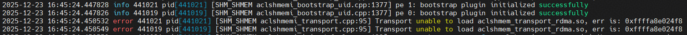
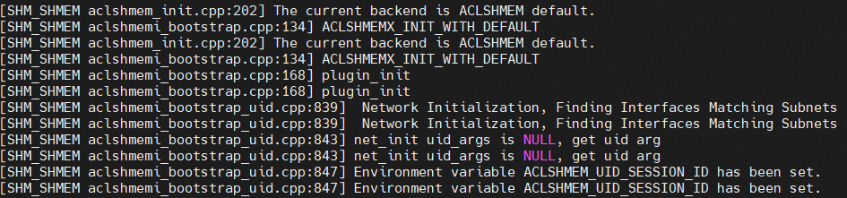
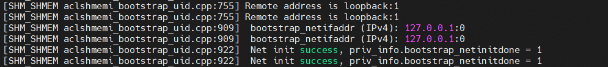
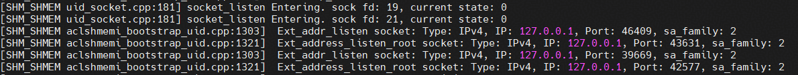
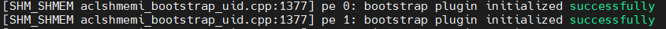
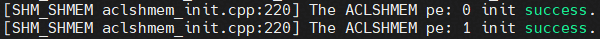
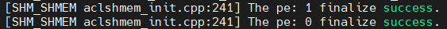

# SHMEM Logs

## Introduction to Environment Variables

The following environment variables are related to SHMEM logs:

* `SHMEM_LOG_LEVEL`: Sets the SHMEM log level. Severity levels from lowest to highest: DEBUG, WARN, INFO, ERROR (default), FATAL. For debugging, DEBUG or INFO is recommended.
* `SHMEM_LOG_TO_STDOUT`: Specifies whether to output SHMEM logs to the console. `0`: no; `1`: yes. By default, this function is disabled and logs are not output to the console. Instead, they are stored in the default path or a specified path. If this function is enabled, logs are printed on the console and will not be flushed to files.
* `SHMEM_LOG_PATH`: Specifies the path for storing SHMEM logs, which must be a valid path. If this parameter is not set, the default path is `${HOME}/shmem/log`.

## Reading Logs

Typically, each SHMEM log entry contains the following information: time, log level, process ID, log module, log file, line number, and log message.

The following uses an example of initializing two PEs and then finalizing them to describe how to read SHMEM logs. In this example, all logs are at the INFO level, so we will focus primarily on the log messages. Information such as the time, log level, and process ID at the beginning of each line will not be specifically extracted or explained.
In the initialization phase, the flag used by the bootstrap (for example, ACLSHMEMX_INIT_WITH_DEFAULT in the figure) is reported first. Then, the bootstrap initialization starts and the settings of environment variables are checked (for example, SHMEM_UID_SESSION_ID is not set in the figure).

SHMEM has a `root 0` node. In a single-server environment, this node can use a loopback address. However, this setting is incorrect in a cluster environment. Therefore, during the initialization, a message is displayed indicating whether the current `root 0` (that is, the remote address) is a loopback address. If yes, a single-server environment is used by default. The current PE can also use a loopback address, and the IP address of the current PE is also displayed in `netifaddr`.

The bootstrap process usually involves the creation and use of multiple sockets. The information about these sockets is also recorded in the logs. You can obtain more detailed socket information by enabling the DEBUG log level, though this will generate a significantly larger volume of logs.

After the bootstrap is successful, a dedicated log entry is generated, and the PE ID is recorded in the log.

After the initialization is successful, a dedicated log entry is generated, and the PE ID is recorded in the log.

After the finalization is successful, a dedicated log entry is generated, and the PE ID is recorded in the log.

Currently, SHMEM logs are mainly used for fault locating on the host side. If an error occurs on an operator on the device side, it may not be possible to locate the fault using SHMEM logs alone. Instead, they must be combined with CANN or relevant tool logs for troubleshooting.
