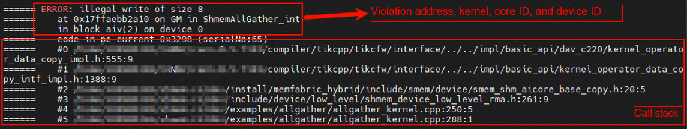

# Operator Debugging Guide for Tools Used with SHMEM

## msprof
SHMEM will adapt to the [msprof operator tuning tool](https://www.hiascend.com/document/detail/en/mindstudio/830/ODtools/Operatordevelopmenttools/atlasopdev_16_0082.html) in the future.
This is not supported in the current version and will be supported in Q1.

## mssanitizer
SHMEM has adapted to the [msSanitizer memory detection tool](https://www.hiascend.com/document/detail/en/mindstudio/830/ODtools/Operatordevelopmenttools/atlasopdev_16_0039.html). The following APIs do not support this tool:
- APIs and test cases for SDMA, RDMA, and UDMA do not support memory detection using msSanitizer.

**This function depends on the CANN version and is expected to be supported in community version 9.1.0.**

If the current CANN version does not support msSanitizer, take the following steps to install it from the source code:

### 1. Installing msSanitizer

Reference: [msSanitizer Installation Guide](https://gitcode.com/Ascend/mssanitizer/blob/master/docs/en/install_guide/mssanitizer_install_guide.md)

Obtain the source code and compile the package.

```sh
git clone https://gitcode.com/Ascend/mssanitizer.git
cd mssanitizer
python build.py
```

Install the .run file.

```sh
cd output
chmod +x mindstudio-sanitizer_*.run
./mindstudio-sanitizer_*.run --run
```

If the `ASCEND_HOME_PATH` environment variable has been configured, install the package to `$ASCEND_HOME_PATH`. Otherwise, install the package to the default path `$HOME/Ascend`.

### 2. Installing mstx

Reference: [mstx Installation Guide](https://gitcode.com/Ascend/mstx/blob/master/docs/en/install_guide/mstx_install_guide.md)

Install the compilation dependencies.

- openEuler/CentOS:

```sh
yum install python3-devel
```

- Ubuntu:

```sh
apt-get install python3-dev
```

Obtain the mstx source code and install the .whl package.

```sh
git clone https://gitcode.com/Ascend/mstx.git
cd mstx
cd output
pip3 install --upgrade mstx-xxxxx.whl --target ${ASCEND_HOME_PATH}/tools/mstx/
```


### 3. Enabling msSanitizer for SHMEM

Build in the `shmem/` directory.
```sh
bash scripts/build.sh -mssanitizer
```

The build options vary depending on the chip model.
- **Ascend 950**: All memory detection functions do not require the `--cce-enable-sanitizer` option. During the build, you only need to add `-g`, and msSanitizer will function normally.
- **Other chip models (such as Ascend 910B)**: Add the `-g --cce-enable-sanitizer` option during the build to enable msSanitizer instrumentation.

The current build script automatically selects the corresponding build options based on `SOC_TYPE`. No manual configuration is required.

By default, the memory detection capability (**--tool memcheck**) is enabled. Generally, you can start the executable file in the following way:
```sh
mssanitizer -- application parameter1 parameter2 ...
```
For more details about the tool capabilities, see [msSanitizer (Anomaly Detection)](https://www.hiascend.com/document/detail/en/mindstudio/830/optools/Operatordevelopmenttools/atlasopdev_16_0039.html). Control the parameters in the following format:
```sh
mssanitizer <options> -- <user_program> <user_options>
```
### Running the SHMEM Sample Using msSanitizer

SHMEM's [AllGather](https://gitcode.com/cann/shmem/tree/master/examples/allgather) sample running script provides the tool option to start the tool.

Compile the sample and enable the tool capability.
```sh
bash scripts/build.sh -examples -mssanitizer
```
Use msSanitizer to start the AllGather sample for memory detection.
```sh
cd examples/allgather
mssanitizer -- bash run.sh -pes 2
```
### Out-of-Bounds Memory Logs
When out-of-bounds memory access occurs, the tool displays information such as the violation address, size of the out-of-bounds memory, kernel, core ID, and device ID.

Then, it displays the call stack of the out-of-bounds memory access code. This helps developers quickly locate out-of-bounds memory access issues and identify code vulnerabilities.



**Note: The memory allocation APIs provided by SHMEM, such as `aclshmem_malloc`, divide a large continuous virtual memory block that has been mapped to the physical memory. Actual physical memory allocation or the mapping of virtual memory to physical memory is not involved. When the virtual address in use has already been mapped to an allocated physical address, no error will be reported even if the address exceeds the range allocated by `aclshmem_malloc` because the memory corresponding to that address can be legally used.**

## Profiling
SHMEM provides a profile data tracing tool. By collecting the number of system clock cycles and converting it into actual time, the tool accurately quantifies the MTE movement performance in different blocks (compute cores) and frames (trace point IDs). For details, see [Using the Profiler to Collect Profile Data in a Sample Project](profiling_en.md).
