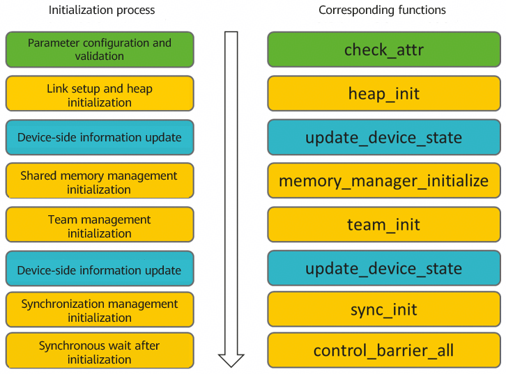
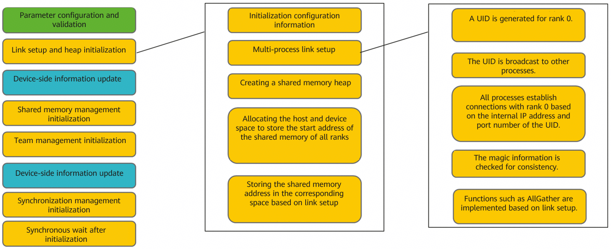
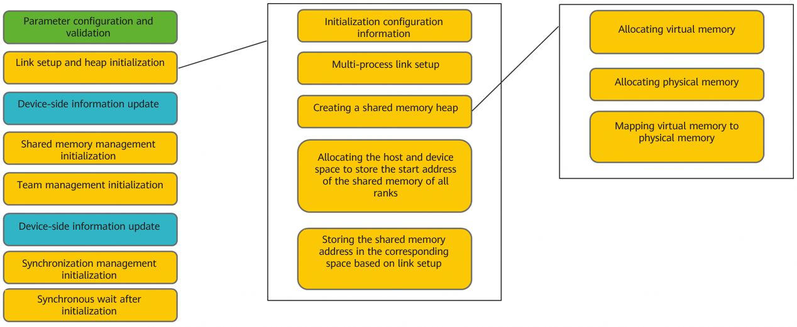
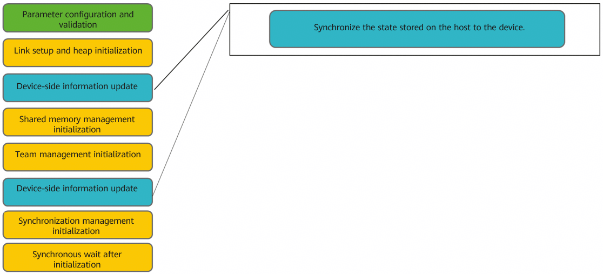
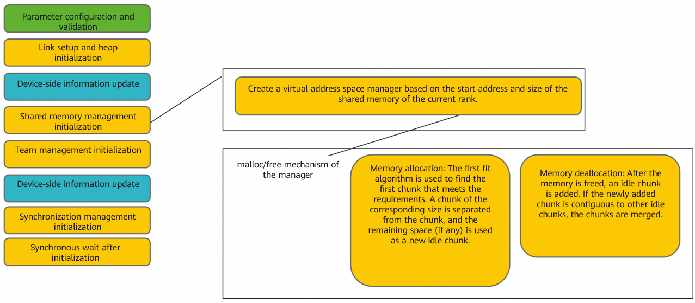
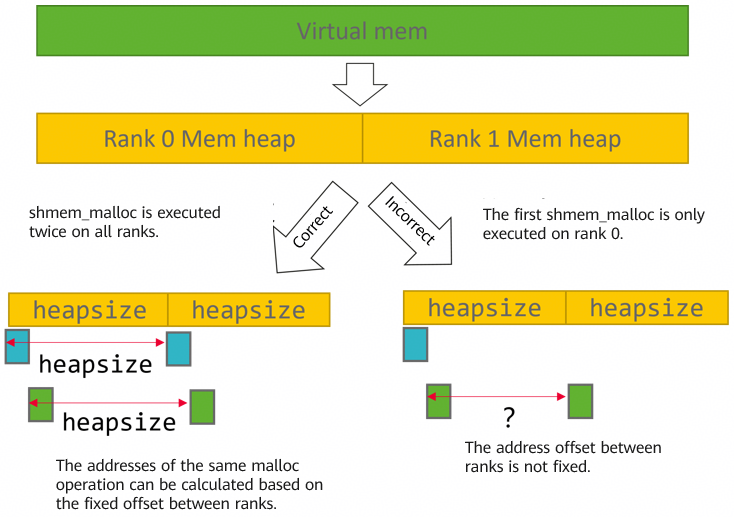
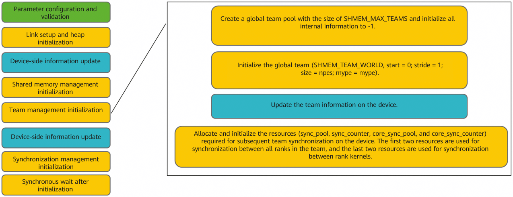
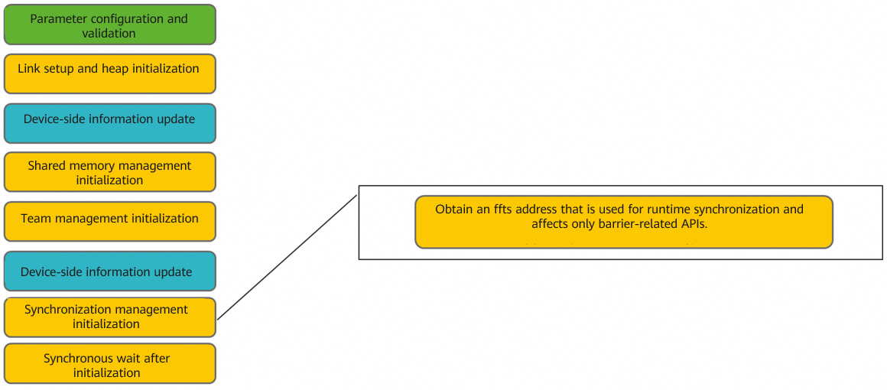
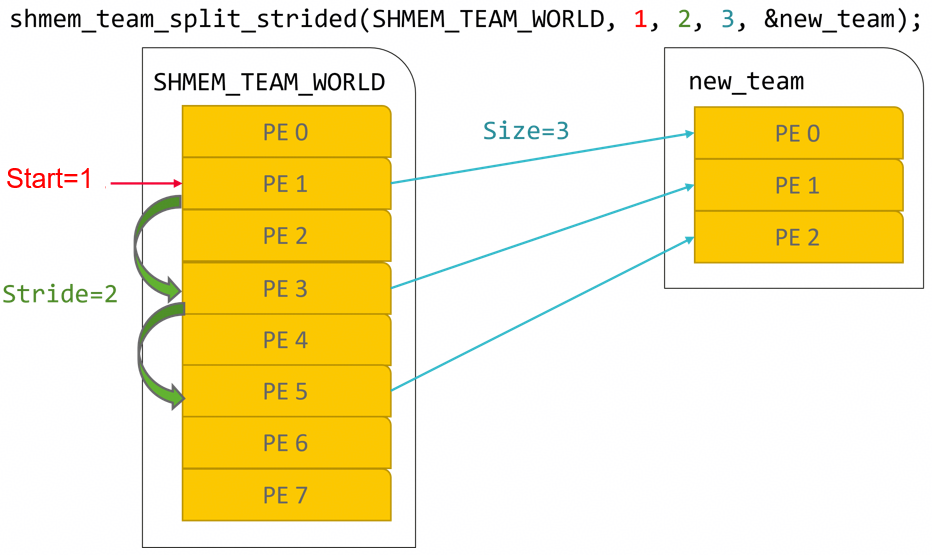

# SHMEM Principles

## SHMEM Initialization Process
<p style="text-indent: 2em;">The SHMEM initialization API <code>int aclshmemx_init_attr(aclshmemx_bootstrap_t bootstrap_flags, aclshmemx_init_attr_t *attributes)</code> initializes the resources required by the SHMEM functions based on the input parameters. The initialization mainly includes information synchronization and link setup between multiple processes, allocation and mapping of virtual memory and physical memory on the devices, and state information synchronization between the host and devices, as well as shared memory management, team management, and synchronization management. The resource information is recorded in <code>aclshmem_device_host_state_t</code>.</p>

The following figure shows the initialization process. The parameter configuration and validation are not described in detail.



### Link Setup Between Multiple Processes
<p style="text-indent: 2em;">The UID initialization process is used as an example. Generally, before the initialization API is called, the UID information of rank 0 is broadcast to all processes through the PyTorch capability. The UID information includes the IP address, port number, and magic (communicator identifier) of rank 0.</p>

<p style="text-indent: 2em;">Link setup between multiple processes is implemented based on TCP sockets. All processes first establish connections with rank 0 based on the IP address and port in the UID. In this process, the processes check whether the magic information in the UID is consistent to determine whether they are in the same communicator. If the magic information is inconsistent, the connections are terminated. After the connection is successful, all ranks can communicate with rank 0. Based on this, the AllGather and barrier capabilities on the host are implemented. (<strong>This capability is not related to <code>aclshmem_barrier</code>, but is similar to <code>MPI_Barrier</code></strong>.</strong></p>)



### Memory Heap Initialization
<p style="text-indent: 2em;">Currently, virtual memory is allocated based on the driver capability, and then physical memory is allocated. After that, the mapping between the virtual memory and physical memory is implemented. In this way, the shared memory address can be managed and accessed in the contiguous virtual address space. For details about the effect and process, see the acl API: <a
href=https://www.hiascend.com/document/detail/en/canncommercial/82RC1/API/appdevgapi/aclcppdevg_03_0114.html>ACL Virtual Memory Management API.</a></p>



Two memory blocks are allocated:
* Shared memory space requested by the user: The memory requested by each rank is the same as the value of `local_mem_size` in the attributes passed during initialization. The shared memory can be managed through APIs such as `aclshmem_malloc` and `aclshmem_free`.
* Metadata space used to store information such as the state and team of SHMEM on the device. When the state and team information changes, the process automatically synchronizes the changes to the metadata space. The metadata space is 32 MB and does not provide external access interfaces.

### State Information Synchronization Between the Host and Device
<p style="text-indent: 2em;">Synchronize the state information of the host. When the state of the host changes, the state is copied to overwrite the memory allocated in the previous phase for storing the state information on the device. The updated state information can be directly obtained when operations are performed on the device.</p>



### Shared Memory Management Initialization
<p style="text-indent: 2em;">Initialize a memory manager based on <code>heap_base</code> and <code>heap_size</code> for subsequent shared memory management. <code>heap_base</code> is the start address of the shared memory of the current rank, and <code>heap_size</code> is the size of the requested shared memory of the current rank.</p>


* `aclshmem_malloc` uses the first fit algorithm to find the first chunk that meets the requirements, separates a chunk of the corresponding size from the chunk, and uses the remaining space (if any) as a new idle chunk.
* After `aclshmem_free` is called to free the memory, an idle chunk is added. If the newly added chunk is contiguous to other idle chunks, the chunks are merged.



<p style="text-indent: 2em;"><strong>The <code>aclshmem_malloc</code> and <code>aclshmem_free</code> APIs must be called synchronously in all processes, and the same size of memory must be allocated or freed. </strong>By default, the memory allocated by aclshmem_malloc in SHMEM is symmetric in the virtual address space. That means <strong>Address of the current rank malloc + <code>heap_size</code> is the address of the next rank malloc</strong>. If the memory allocated between processes is different, the start addresses of the subsequently allocated memory will be asymmetric, and correct data cannot be accessed through address offset.</p>



### Team Management Initialization
<p style="text-indent: 2em;">Create a global team pool with the size of <code>ACLSHMEM_MAX_TEAMS</code>. Initialize all internal information to -1.
Initialize the global team (<code>ACLSHMEM_TEAM_WORLD</code>, <code>start=0</code>, <code>stride=1</code>, <code>size=npes</code>, and <code>mype=mype</code>). That means the synchronization starts from rank 0, the stride is 1, the number of global PEs is npes, and the current PE is mype. (<strong>The details about the team will be described in the team part. Here, only the attribute information of the global team is briefly described.</strong>)</p>

<p style="text-indent: 2em;">Allocate and initialize the resources (<code>sync_pool</code>, <code>sync_counter</code>, <code>core_sync_pool</code>, and <code>core_sync_counter</code>) required for subsequent team-level synchronization on the device. The first two are used for synchronization between all ranks in a team, and the last two are used for synchronization between rank kernels.</p>


<strong>`team_pool`, `sync_pool`, `sync_counter`, `core_sync_pool`, and `core_sync_counter` are stored in the state.</strong>



### Synchronization Management Initialization
<p style="text-indent: 2em;">Only one ffts address is obtained, which can be obtained later through <code>shmemx_get_ffts_config</code>. It is set within the operator through <code>shmemx_set_ffts_config</code> and is used for runtime synchronization. At the AscendC level, it affects the <code>SyncAll</code>, <code>CrossCoreSetFlag</code>, and <code>CrossCoreWaitFlag</code> APIs. At the SHMEM layer, it affects barrier-related APIs. (The overhead of <code>shmemx_set_ffts_config</code> is small. It is recommended that this API be called once in each operator.)</p>



## SHMEM Communicator (Team)
<p style="text-indent: 2em;">A team is a communicator in SHMEM. It can be accessed through team_id in related APIs. After initialization, there is a default global team, whose <code>team_id</code> is <code>ACLSHMEM_TEAM_WORLD = 0</code>. The team information is stored in <code>team_pools</code> of the state. team_pools is an array of <code>aclshmemx_team_t</code>. <code>aclshmemx_team_t</code> stores information such as the ID of the current team (index used by team-related APIs), rank ID of the current process in the team, start rank in the team, rank stride, and number of ranks.</p>

**`mype` and `size` stored in `aclshmemx_team_t` are internal information of the team, while `mype` and `npes` stored in `aclshmem_device_host_state_t` are global information.**
For example, initialize SHMEM for four ranks, with the first two ranks forming a team and the last two ranks forming a team. In this case, the values of `mype` in the state of the four ranks are 0, 1, 2, and 3, respectively. `npes` is `4`. However, the `mype` values in `team_pools` are 0, 1, 0, and 1, respectively. `size` is `2`.
### Child Team Splitting
SHMEM provides a dedicated API for splitting child teams.

```c++
int aclshmem_team_split_strided(aclshmem_team_t parent_team, int pe_start, int pe_stride, int pe_size, aclshmem_team_t *new_team);

```
<p style="text-indent: 2em;"><code>parent_team</code> indicates the parent team, <code>pe_start</code> indicates the start PE, <code>pe_stride</code> indicates the stride for each splitting, <code>pe_size</code> indicates the number of PEs in the new team, and <code>new_team</code> is an output parameter indicating the ID of the new team obtained after splitting.</p>


Take the scenario where eight ranks are initialized as an example. Call the splitting API as follows:
```c++
aclshmem_team_t new_team;
// Start from the PE whose idx is 1 in the global team, and stop after three PEs are split with a stride of 2.
auto ret = aclshmem_team_split_strided(ACLSHMEM_TEAM_WORLD, 1, 2, 3, &new_team);

```
The `mype` values of the three PEs in the state of `new_team` are 1, 3, and 5, respectively, and the `mype` values in their `team_pools` are 0, 1, and 2, respectively.



### Team Usage
<p style="text-indent: 2em;">When an operator needs to run only on some ranks, team-related APIs are required. For example, <code>aclshmem_team_my_pe(my_team)</code> can return the mype value of the current rank in <code>my_team</code>, and <code>aclshmem_my_pe()</code> can return the mype value of the current rank in the global team. Generally, the team-level mype value can be used as the index of the internal resource array of the operator, and the global mype value can be used as the index of the global shared memory address information.</p>


<p style="text-indent: 2em;"><code>team_id</code> is also used by synchronization APIs, such as the team-level synchronization API <code>aclshmem_barrier(aclshmem_team_t tid)</code> provided by SHMEM.</p>
