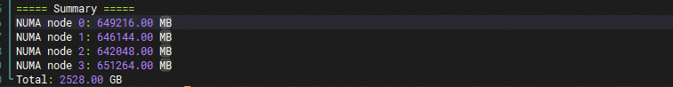

## Overview

This example describes how to use the scalar put and get data transfer APIs to access the host memory based on the SHMEM project.

## Supported Product Models

- Atlas A3 training products and Atlas A3 inference products

## Example Implementation

This example demonstrates the workflow of the SHMEM scalar put and get data transfer APIs.

### Test Case Implementation

(1) Initialize [ACL](https://www.hiascend.com/document/detail/en/CANNCommunityEdition/83RC1alpha003/API/appdevgapi/aclcppdevg_03_1945.html) and [SHMEM](../../README_en.md), allocate memory for input and output data, and initialize the data. The input data is initialized to 0, and the output data is the current my_pe. Subsequently, the put API sends the current PE's ID to the input of the next PE, and the get API obtains the output of the next PE.

(2) Call run_demo_scalar to start the kernel and execute the corresponding kernel implementation. Insert synchronization barriers by calling aclshmem_barrier before and after the execution to ensure that the kernel runs without interference.

(3) Verify the execution results and check whether the result on each PE meets the expectation.

(4) Clean up and release SHMEM and ACL resources.

### Kernel Implementation

(1) On the kernel side, obtain the current PE's ID, the total number of PEs, and the target PE's ID.

(2) Call the `aclshmem_int32_p` API to send the current PE's ID to the input of the next PE, and call the `aclshmem_quiet` API to insert a synchronization barrier and wait until the scalar data is sent.

(3) Call `aclshmem_int32_g` to obtain the output data of the next PE, call `aclshmem_quiet` to insert a synchronization barrier and wait until the scalar data is received, and fill the data in the output of the current PE.

## Build and Execution

For details about environment configuration, see [Quick Start](../../docs/quickstart_en.md). After the environment is configured, run the following commands to verify the function:

```bash
# Build the case.
bash scripts/build.sh -examples -cann
cd examples/rma_d2h_demo
# Run the case.
bash run.sh
```

After the case is executed, if `[INFO] demo run end in pe <my_pe>` is displayed, the case execution is complete. If `[SUCCESS] run success in pe <my_pe>` is displayed, the case is successfully executed and the result is correct.

## Restrictions

### Querying the Available Memory Size of A3 SuperPoD

Run the [check_support.py](./check_support.py) script to scan the available physical memory.

```bash
python3 check_support.py
```



In this example, the default host memory size is 1 GB. The total available memory must be greater than 1 GB.

### Configuration Requirements for the A3 SuperPoD Server ID

When running this example in the A3 SuperPoD environment, ensure that the Server ID configuration on each server is correct. Especially after faulty hardware is replaced, the Server ID may not be correctly configured, which will cause the example to fail to run.

#### How to Query the Server ID

Use the npu-smi tool to query the Server ID configuration of the current server.

```bash
npu-smi info -t spod-info -i 0 -c 0
```

Example output:

```bash
SDID : 16777216
Super Pod Size : 384
Super Pod ID : 0
Server Index : 4
```

`Server Index` indicates the Server ID of the current server. Ensure that it is identical for all NPUs within a single compute node.

#### How to Configure the Server ID

If the Server ID is incorrect, you can modify it using the following method:

1. **Through the Redfish API**
   - Reference: [Redfish API documentation](https://support.huawei.com/enterprise/en/doc/EDOC1100401665/1f8efb4e?idPath=23710424|251366513|22892968|252309113|261207247)
