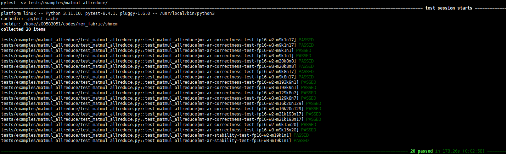

# Operator Generalization Test Framework

## 1. Overview
This test framework is designed to provide an automated and extensible generalization precision testing environment for the [SHMEM](https://gitcode.com/cann/shmem) kernel series, built on `pytest`. The framework randomly generates test cases covering diverse data types, tensor shapes, and value distributions. These test cases are executed by the C++ kernels, and the results are compared against ground truth values computed with `NumPy` on the CPU. This ensures rigorous validation of kernel correctness and numerical precision.

## 2. Framework Structure
```
tests/examples/
├── config.py # Global test configuration file
├── utils.py # Common utility functions (for example, dynamic error tolerance calculation)
├── np_uniform_generator.py # Uniform distribution random number generator
├── np_normal_generator.py # Normal distribution random number generator
├── matmul_allreduce/
│ ├── test_fusion_matmul_allreduce.py # Pytest script for the matmul_allreduce kernel
│ └── test_data/ # Persistent cache directory for test data
├── readme.md # This document
└──... # Other kernel-specific test directories
```
-   `config.py`: defines global configuration for the entire test framework, including tensor shape constraints, distribution parameters, data types, and precision thresholds.
-   `utils.py`: contains common utility functions, especially the `get_rtol()` function, which dynamically computes the error tolerance based on the data type and computational workload.
-   `np_uniform_generator.py` or `np_normal_generator.py`: generates test data following uniform or normal distributions.
-   `<kernel_name>/test_<kernel_name>.py`: Pytest scripts for specific kernels.
-   `<kernel_name>/test_data/`: stores generated test data for debugging and analysis.

## 3. Core Logic

The execution process of the test script (`test_fusion_matmul_allreduce.py`) is as follows:

### 3.1. Test Case Generation
-   **Parameter combinations and classification**: The `get_test_cases` function generates two categories of test cases:
    -   **Correctness tests**: Validate basic functionality with relatively small input ranges.
    -   **Numerical stability tests**: Validate behavior under extreme or special values with more complex inputs.
    A series of `pytest.param` objects are generated based on parameters defined in `config.py` (for example, data types, `rank` count, and the number of test cases per category). They are used for driver tests.
-   **Shape generation**: The `generate_shapes` function randomly generates valid tensor shapes based on the constraints (such as `SHAPE_DIM_VALUES` and `SHAPE_DIM_RANDOM_RANGE`) in `config.py`.

### 3.2. Data and Ground Truth Generation
-   **Tensor generation**:
    -   For **correctness** tests, use `NPUniformGenerator` to generate uniformly distributed tensors within a predefined small range.
    -   For **numerical stability** tests, use `NPNormalGenerator` to generate tensors following a normal distribution, potentially containing more challenging values.
-   **Ground truth computation**: `NumPy` is used on the CPU to compute ground truth values. Intermediate accumulation is performed in `fp32` for precision and finally converted to the target precision.
-   **Overflow handling**: After ground truth generation, the framework checks for `inf` or `NaN`. If detected, the test case is skipped via `pytest.skip()` to avoid false failures caused by invalid input data.

### 3.3. Data Persistence
-   Each test case's parameter combination is hashed into a unique MD5 value.
-   A directory (located in `test_data/<hash_value>`) is created using the hash value, storing all input tensors (`rank_<i>_a.bin` and `rank_<i>_b.bin`) of the test case. This facilitates subsequent reproduction and debugging.

### 3.4. C++ Kernel Execution
-   The `multiprocessing` module of Python spawns a separate process for each `rank`.
-   Each process calls a precompiled C++ executable file (`EXECUTABLE_PATH`).
-   The parameters required for the test, including the `rank`, `world_size`, network address, and **the data persistence directory**, are passed to the C++ program through command-line arguments.
-   The C++ program reads the input from the specified data directory and writes the computation result `aclshmem_output.bin` back to the same directory as the input data.

### 3.5. Result Verification
-   After all C++ processes complete, the main process reads `aclshmem_output.bin` from the data directory.
-   **Dynamic precision validation**:
    1.  **Compute the operation count**: Compute the total number of floating-point operations (FLOPs) based on the `m, k, n, and world_size`.
    2.  **Obtain the tolerance**: Call the `get_rtol()` function in `utils.py`, passing the data type and operation count to obtain a dynamically computed error tolerance `err`.
    3.  **Verify the result with dual standards**:
        -   For ground truth values with absolute magnitude ≥ `1.0`, perform a **relative error** check: `|act - gt| / |gt| <= err`.
        -   For ground truth values with absolute magnitude < `1.0`, perform an **absolute error** check: `|act - gt| <= err`.

## 4. Running a Test
1.  **Build the kernel function**: Ensure that the C++ executable file of the target kernel function has been built. For example, for `matmul_allreduce`, run the following command first:
    ```bash
    bash examples/matmul_allreduce/scripts/build.sh
    ```
2.  **Set the executable file path**: At the top of the `test_fusion_matmul_allreduce.py` script, ensure that the `EXECUTABLE_PATH` variable points to the correct C++ executable file path.
3.  **Run pytest**: In the root directory of the project, run the `pytest` command.
    ```bash
    export LD_LIBRARY_PATH=<path_to_aclshmem_lib>:$LD_LIBRARY_PATH
    pytest -sv tests/examples/matmul_allreduce/
    ```
    *Replace `<path_to_...>` with the actual library path.*

4. **Output example**<br>

<br>Note: Cases with `correctness` are correctness test cases, and cases with `stability` are numerical stability test cases.


## 5. Extension
To add a test for a new kernel (for example, `allgather`), perform the following steps:
1.  Create a new subdirectory, for example, `allgather`, in the `tests/examples/`.
2.  Create a new test script in this directory, for example, `test_allgather.py`.
3.  Implement the test logic of the new kernel by referring to the structure of `test_matmul_allreduce.py`.
    -   Implement the data generation logic (by reusing `NP*Generator` or creating a new generator) and ground truth computation.
    -   Call the auxiliary function of the C++ kernel.
    -   Implement the result verification logic. You can reuse the `get_rtol` and dual-standard verification method.
4.  If a new general configuration is required, add it to `tests/examples/config.py`.
